# AI Brain: Client Communication & Retention System - Architecture

## 📋 Table of Contents
1. [System Overview](#system-overview)
2. [High-Level Architecture](#high-level-architecture)
3. [Core Components](#core-components)
4. [Data Flow Diagrams](#data-flow-diagrams)
5. [Key Workflows](#key-workflows)
6. [Technology Stack](#technology-stack)
7. [Integration Points](#integration-points)
8. [Implementation Phases](#implementation-phases)

---

## System Overview

The AI Brain is a comprehensive client communication and retention system that ensures every client Silverlight has ever engaged with remains in consistent, intelligent communication across all channels (Email, WhatsApp, LinkedIn, SMS, etc.).

### Core Capabilities
- **Multi-channel communication** (Email, WhatsApp, LinkedIn, SMS, Telegram, Facebook, Instagram, LINE, Viber, WeChat, RCS, Apple Messages, TikTok)
- **Intelligent follow-up automation** with personalized responses
- **Form chasing** until completion
- **Client scheduling** and rescheduling automation
- **LinkedIn monitoring** and engagement
- **Relationship nurturing** and retention mechanisms
- **Conversation memory** across all channels

---

## High-Level Architecture

```mermaid
graph TB
    subgraph "Client Entry Points"
        CE1[Email<br/>client-team@silverlightgroup.com]
        CE2[WhatsApp<br/>via Kommo CRM]
        CE3[LinkedIn<br/>SalesRobot/HeyReach/AimFox]
        CE4[Website Forms<br/>Zoho Forms]
        CE5[Zoho Sign<br/>Agreements]
    end

    subgraph "Core Processing Layer"
        PI[Message Parser<br/>& Classifier]
        AI[AI Response<br/>Generator]
        FU[Follow-Up<br/>Orchestrator]
        SCHED[Scheduling<br/>Engine]
        FORM[Form Chasing<br/>Engine]
        LI[LinkedIn Monitor<br/>& Engagement]
    end

    subgraph "Communication Layer"
        RESPOND[Respond.io Platform<br/>Primary Hub]
        INFOBIP[Infobip Platform<br/>Secondary Hub]
        KOMMO[Kommo CRM<br/>WhatsApp Line-by-Line]
        LINKEDIN[LinkedIn Automation<br/>SalesRobot/HeyReach/AimFox]
    end

    subgraph "Communication Channels"
        WA[WhatsApp Business]
        EMAIL[Email]
        SMS[SMS]
        TELEGRAM[Telegram]
        FACEBOOK[Facebook Messenger]
        INSTAGRAM[Instagram DM]
        LINE[LINE]
        VIBER[Viber]
        WECHAT[WeChat]
        RCS[RCS]
        APPLE[Apple Messages]
        TIKTOK[TikTok]
    end

    subgraph "Data Storage"
        GS[Google Sheets<br/>Client Calls]
        CRM[Respond.io CRM<br/>Primary CRM]
        DB[(PostgreSQL<br/>Conversation History)]
        STORAGE[Cloud Storage<br/>Attachments]
    end

    subgraph "External Services"
        CAL[Office 365/Google<br/>Calendar API]
        ZOHO[Zoho Forms<br/>& Zoho Sign]
        ENRICH[Enrichment Tools<br/>Apollo, Clay]
    end

    CE1 --> PI
    CE2 --> PI
    CE3 --> PI
    CE4 --> PI
    CE5 --> PI

    PI --> AI
    PI --> FU
    PI --> SCHED
    PI --> FORM
    PI --> LI

    AI --> RESPOND
    AI --> INFOBIP
    AI --> KOMMO
    AI --> LINKEDIN

    FU --> RESPOND
    FU --> INFOBIP
    FU --> KOMMO

    SCHED --> CAL
    FORM --> RESPOND
    FORM --> INFOBIP
    FORM --> KOMMO

    LI --> LINKEDIN

    RESPOND --> WA
    RESPOND --> EMAIL
    RESPOND --> SMS
    RESPOND --> TELEGRAM
    RESPOND --> FACEBOOK
    RESPOND --> INSTAGRAM
    RESPOND --> LINE
    RESPOND --> WECHAT
    RESPOND --> TIKTOK

    INFOBIP --> INSTAGRAM
    INFOBIP --> VIBER
    INFOBIP --> RCS
    INFOBIP --> APPLE
    INFOBIP --> SMS

    KOMMO --> WA

    PI --> GS
    AI --> CRM
    FU --> DB
    SCHED --> DB
    FORM --> DB
    LI --> DB

    GS --> DB
    CRM --> DB

    ZOHO --> PI
    ENRICH --> DB
```

---

## Core Components

### 1. Message Parser & Classifier

**Purpose**: Process incoming messages and classify intent

**Key Functions**:
- Email parsing and classification
- WhatsApp message parsing
- LinkedIn message parsing
- Intent detection (scheduling, form question, general inquiry)
- Entity extraction (client name, company, timezone)
- Sentiment analysis

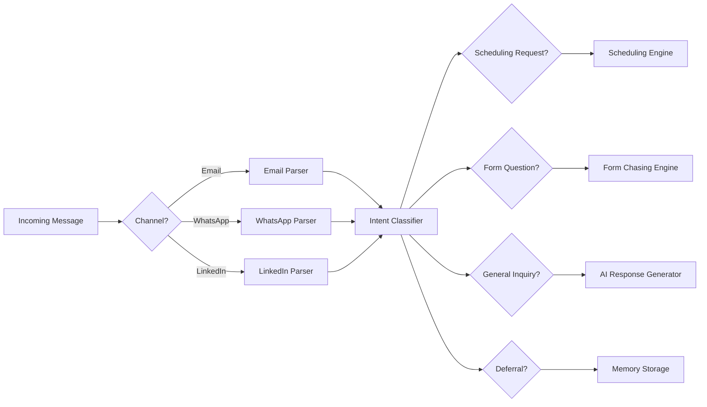
```mermaid
graph LR
    A[Incoming Message] --> B{Channel?}
    B -->|Email| C[Email Parser]
    B -->|WhatsApp| D[WhatsApp Parser]
    B -->|LinkedIn| E[LinkedIn Parser]
    
    C --> F[Intent Classifier]
    D --> F
    E --> F
    
    F --> G{Scheduling Request?}
    F --> H{Form Question?}
    F --> I{General Inquiry?}
    F --> J{Deferral?}
    
    G --> SCHED[Scheduling Engine]
    H --> FORM[Form Chasing Engine]
    I --> AI[AI Response Generator]
    J --> MEMORY[Memory Storage]
```

### 2. AI Response Generator

**Purpose**: Generate personalized, context-aware responses

**Key Functions**:
- Access conversation history from database
- Generate personalized responses
- Maintain tone consistency (Diana for email, Catherine for WhatsApp)
- Handle deferrals ("let's talk next month")
- Multi-brand support (Silverlight, DeepResearch, etc.)

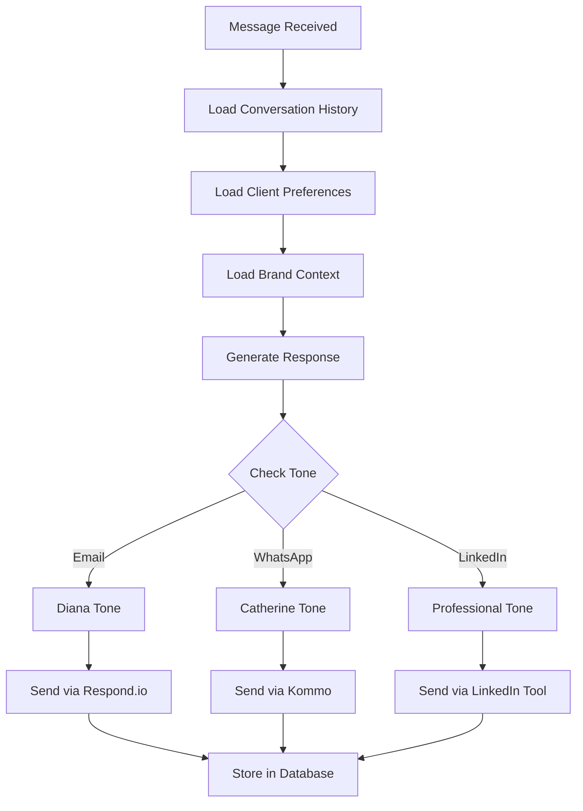
```mermaid
graph TD
    A[Message Received] --> B[Load Conversation History]
    B --> C[Load Client Preferences]
    C --> D[Load Brand Context]
    
    D --> E[Generate Response]
    E --> F{Check Tone}
    F -->|Email| G[Diana Tone]
    F -->|WhatsApp| H[Catherine Tone]
    F -->|LinkedIn| I[Professional Tone]
    
    G --> J[Send via Respond.io]
    H --> K[Send via Kommo]
    I --> L[Send via LinkedIn Tool]
    
    J --> M[Store in Database]
    K --> M
    L --> M
```

### 3. Follow-Up Orchestrator

**Purpose**: Manage automated follow-ups with intelligent timing

**Key Functions**:
- Track response times per client
- Adapt follow-up timing to client behavior
- Enforce monthly engagement rule (30-day touchpoint)
- Handle quarterly re-engagement
- Prevent duplicate messages

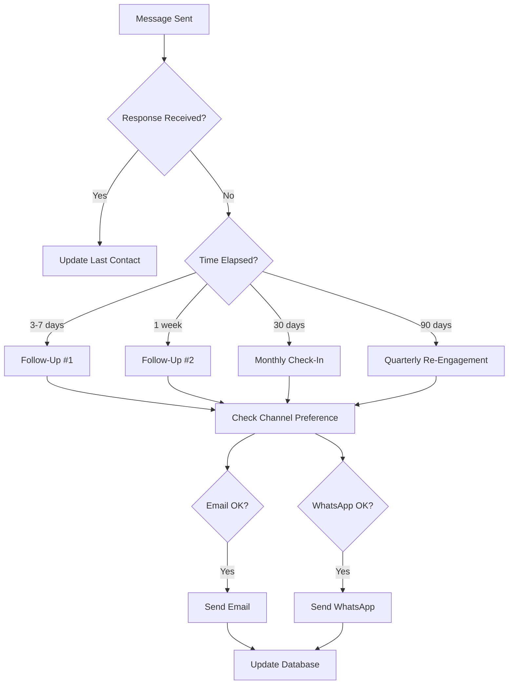
```mermaid
graph TB
    A[Message Sent] --> B{Response Received?}
    B -->|Yes| C[Update Last Contact]
    B -->|No| D{Time Elapsed?}
    
    D -->|3-7 days| E[Follow-Up #1]
    D -->|1 week| F[Follow-Up #2]
    D -->|30 days| G[Monthly Check-In]
    D -->|90 days| H[Quarterly Re-Engagement]
    
    E --> I[Check Channel Preference]
    F --> I
    G --> I
    H --> I
    
    I --> J{Email OK?}
    I --> K{WhatsApp OK?}
    
    J -->|Yes| L[Send Email]
    K -->|Yes| M[Send WhatsApp]
    
    L --> N[Update Database]
    M --> N
```

### 4. Scheduling Engine

**Purpose**: Automate client call scheduling and rescheduling

**Key Functions**:
- Detect scheduling requests
- Timezone detection and conversion
- Calendar invite creation (Office 365 or Google Calendar)
- Rescheduling automation (no-show, declined)
- Reminder automation (24h, 1h before)
- Deferral memory ("let's talk next month")

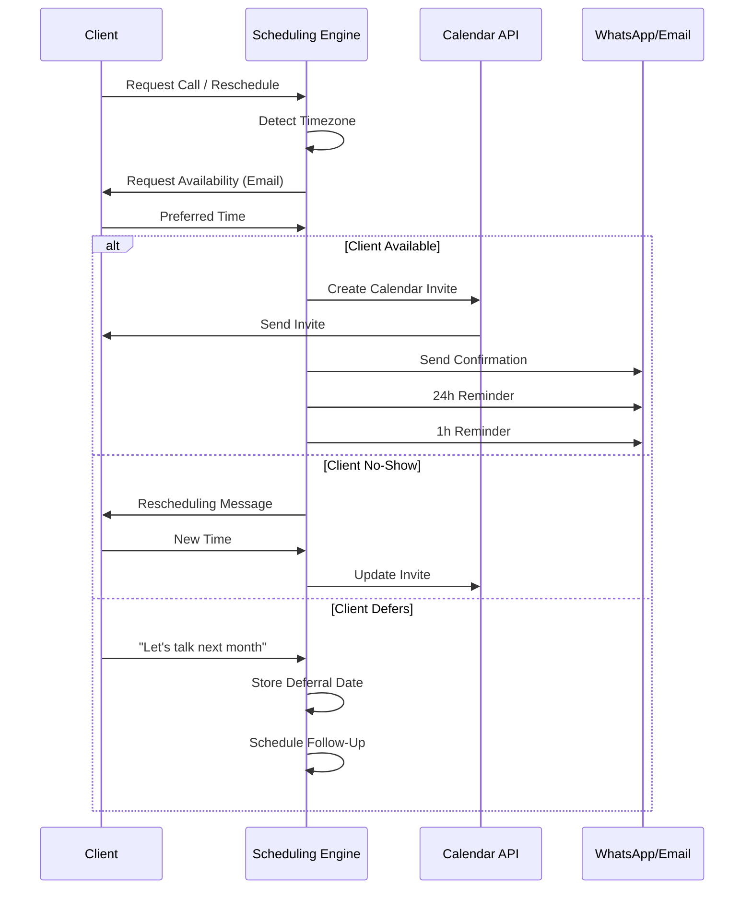
```mermaid
sequenceDiagram
    participant C as Client
    participant SYS as Scheduling Engine
    participant CAL as Calendar API
    participant WA as WhatsApp/Email

    C->>SYS: Request Call / Reschedule
    SYS->>SYS: Detect Timezone
    SYS->>C: Request Availability (Email)
    C->>SYS: Preferred Time
    
    alt Client Available
        SYS->>CAL: Create Calendar Invite
        CAL->>C: Send Invite
        SYS->>WA: Send Confirmation
        SYS->>WA: 24h Reminder
        SYS->>WA: 1h Reminder
    else Client No-Show
        SYS->>C: Rescheduling Message
        C->>SYS: New Time
        SYS->>CAL: Update Invite
    else Client Defers
        C->>SYS: "Let's talk next month"
        SYS->>SYS: Store Deferral Date
        SYS->>SYS: Schedule Follow-Up
    end
```

### 5. Form Chasing Engine

**Purpose**: Automatically chase form completions until done

**Key Functions**:
- Detect form submissions (Zoho Forms, Zoho Sign)
- Multi-channel follow-up (Email + WhatsApp)
- Stop automatically when form completed
- Handle deferrals ("not for now")
- Remember communication across channels

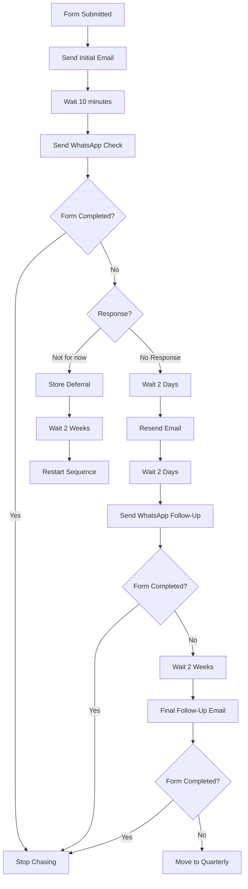
```mermaid
graph TD
    A[Form Submitted] --> B[Send Initial Email]
    B --> C[Wait 10 minutes]
    C --> D[Send WhatsApp Check]
    
    D --> E{Form Completed?}
    E -->|Yes| F[Stop Chasing]
    E -->|No| G{Response?}
    
    G -->|"Not for now"| H[Store Deferral]
    G -->|No Response| I[Wait 2 Days]
    
    I --> J[Resend Email]
    J --> K[Wait 2 Days]
    K --> L[Send WhatsApp Follow-Up]
    
    L --> M{Form Completed?}
    M -->|Yes| F
    M -->|No| N[Wait 2 Weeks]
    
    N --> O[Final Follow-Up Email]
    O --> P{Form Completed?}
    P -->|Yes| F
    P -->|No| Q[Move to Quarterly]
    
    H --> R[Wait 2 Weeks]
    R --> S[Restart Sequence]
```

### 6. LinkedIn Monitor & Engagement

**Purpose**: Monitor client LinkedIn activity and engage automatically

**Key Functions**:
- Monitor client profiles (monthly/quarterly)
- Detect promotions, company changes, posts
- Send congratulatory messages
- Engage with posts
- Update CRM records

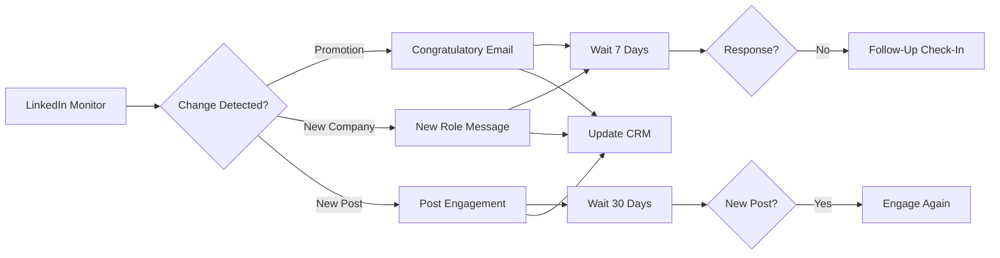
```mermaid
graph LR
    A[LinkedIn Monitor] --> B{Change Detected?}
    B -->|Promotion| C[Congratulatory Email]
    B -->|New Company| D[New Role Message]
    B -->|New Post| E[Post Engagement]
    
    C --> F[Wait 7 Days]
    D --> F
    E --> G[Wait 30 Days]
    
    F --> H{Response?}
    H -->|No| I[Follow-Up Check-In]
    
    G --> J{New Post?}
    J -->|Yes| K[Engage Again]
    
    C --> L[Update CRM]
    D --> L
    E --> L
```

---

## Data Flow Diagrams

### Client Communication Flow

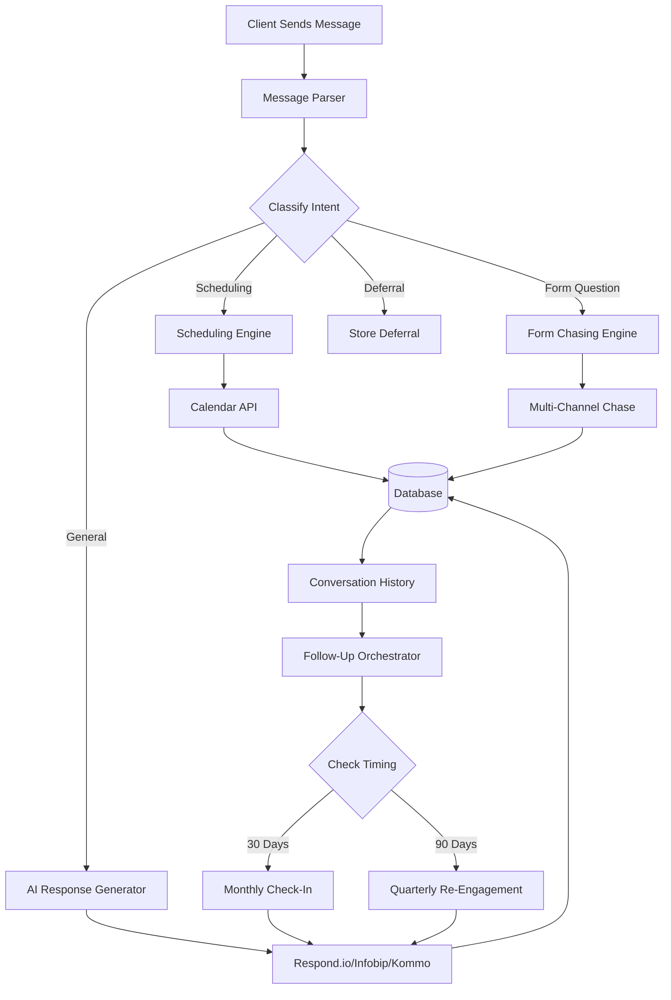
```mermaid
flowchart TD
    START[Client Sends Message] --> INTAKE[Message Parser]
    
    INTAKE --> CLASSIFY{Classify Intent}
    CLASSIFY -->|Scheduling| SCHED[Scheduling Engine]
    CLASSIFY -->|Form Question| FORM[Form Chasing Engine]
    CLASSIFY -->|General| AI[AI Response Generator]
    CLASSIFY -->|Deferral| MEMORY[Store Deferral]
    
    SCHED --> CAL[Calendar API]
    FORM --> CHASE[Multi-Channel Chase]
    AI --> RESPOND[Respond.io/Infobip/Kommo]
    
    CAL --> STORE1[(Database)]
    CHASE --> STORE1
    RESPOND --> STORE1
    
    STORE1 --> HISTORY[Conversation History]
    HISTORY --> FU[Follow-Up Orchestrator]
    
    FU --> TIMING{Check Timing}
    TIMING -->|30 Days| MONTHLY[Monthly Check-In]
    TIMING -->|90 Days| QUARTERLY[Quarterly Re-Engagement]
    
    MONTHLY --> RESPOND
    QUARTERLY --> RESPOND
```

### Multi-Channel Coordination Flow

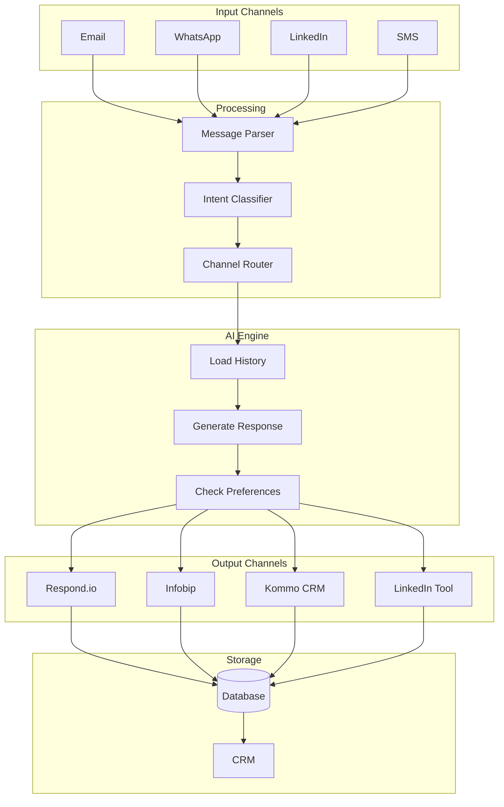
```mermaid
graph TB
    subgraph "Input Channels"
        A1[Email]
        A2[WhatsApp]
        A3[LinkedIn]
        A4[SMS]
    end
    
    subgraph "Processing"
        B1[Message Parser]
        B2[Intent Classifier]
        B3[Channel Router]
    end
    
    subgraph "AI Engine"
        C1[Load History]
        C2[Generate Response]
        C3[Check Preferences]
    end
    
    subgraph "Output Channels"
        D1[Respond.io]
        D2[Infobip]
        D3[Kommo CRM]
        D4[LinkedIn Tool]
    end
    
    subgraph "Storage"
        E1[(Database)]
        E2[CRM]
    end
    
    A1 --> B1
    A2 --> B1
    A3 --> B1
    A4 --> B1
    
    B1 --> B2
    B2 --> B3
    
    B3 --> C1
    C1 --> C2
    C2 --> C3
    
    C3 --> D1
    C3 --> D2
    C3 --> D3
    C3 --> D4
    
    D1 --> E1
    D2 --> E1
    D3 --> E1
    D4 --> E1
    
    E1 --> E2
```

---

## Key Workflows

### Workflow 1: Complete Form Chasing Sequence

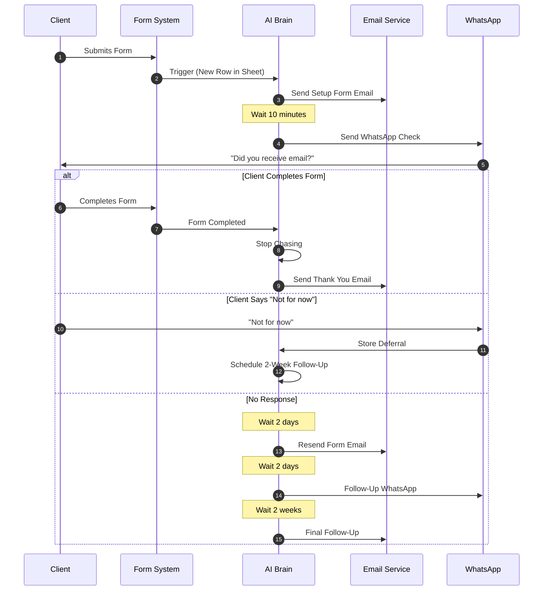
```mermaid
sequenceDiagram
    autonumber
    participant C as Client
    participant FORM as Form System
    participant SYS as AI Brain
    participant EMAIL as Email Service
    participant WA as WhatsApp

    C->>FORM: Submits Form
    FORM->>SYS: Trigger (New Row in Sheet)
    SYS->>EMAIL: Send Setup Form Email
    Note over SYS: Wait 10 minutes
    SYS->>WA: Send WhatsApp Check
    WA->>C: "Did you receive email?"
    
    alt Client Completes Form
        C->>FORM: Completes Form
        FORM->>SYS: Form Completed
        SYS->>SYS: Stop Chasing
        SYS->>EMAIL: Send Thank You Email
    else Client Says "Not for now"
        C->>WA: "Not for now"
        WA->>SYS: Store Deferral
        SYS->>SYS: Schedule 2-Week Follow-Up
    else No Response
        Note over SYS: Wait 2 days
        SYS->>EMAIL: Resend Form Email
        Note over SYS: Wait 2 days
        SYS->>WA: Follow-Up WhatsApp
        Note over SYS: Wait 2 weeks
        SYS->>EMAIL: Final Follow-Up
    end
```

### Workflow 2: Client Scheduling Automation

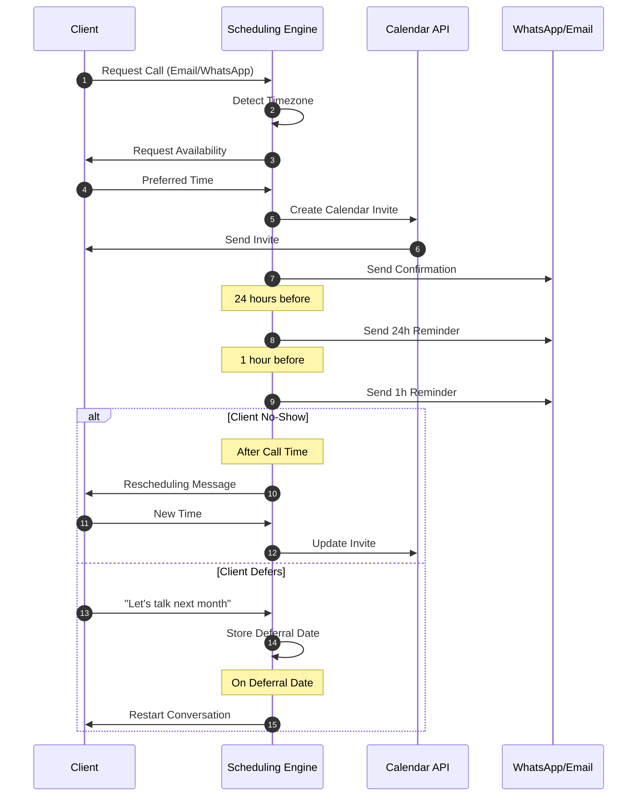
```mermaid
sequenceDiagram
    autonumber
    participant C as Client
    participant SYS as Scheduling Engine
    participant CAL as Calendar API
    participant WA as WhatsApp/Email

    C->>SYS: Request Call (Email/WhatsApp)
    SYS->>SYS: Detect Timezone
    SYS->>C: Request Availability
    C->>SYS: Preferred Time
    
    SYS->>CAL: Create Calendar Invite
    CAL->>C: Send Invite
    
    SYS->>WA: Send Confirmation
    Note over SYS: 24 hours before
    SYS->>WA: Send 24h Reminder
    Note over SYS: 1 hour before
    SYS->>WA: Send 1h Reminder
    
    alt Client No-Show
        Note over SYS: After Call Time
        SYS->>C: Rescheduling Message
        C->>SYS: New Time
        SYS->>CAL: Update Invite
    else Client Defers
        C->>SYS: "Let's talk next month"
        SYS->>SYS: Store Deferral Date
        Note over SYS: On Deferral Date
        SYS->>C: Restart Conversation
    end
```

### Workflow 3: LinkedIn Monitoring & Engagement

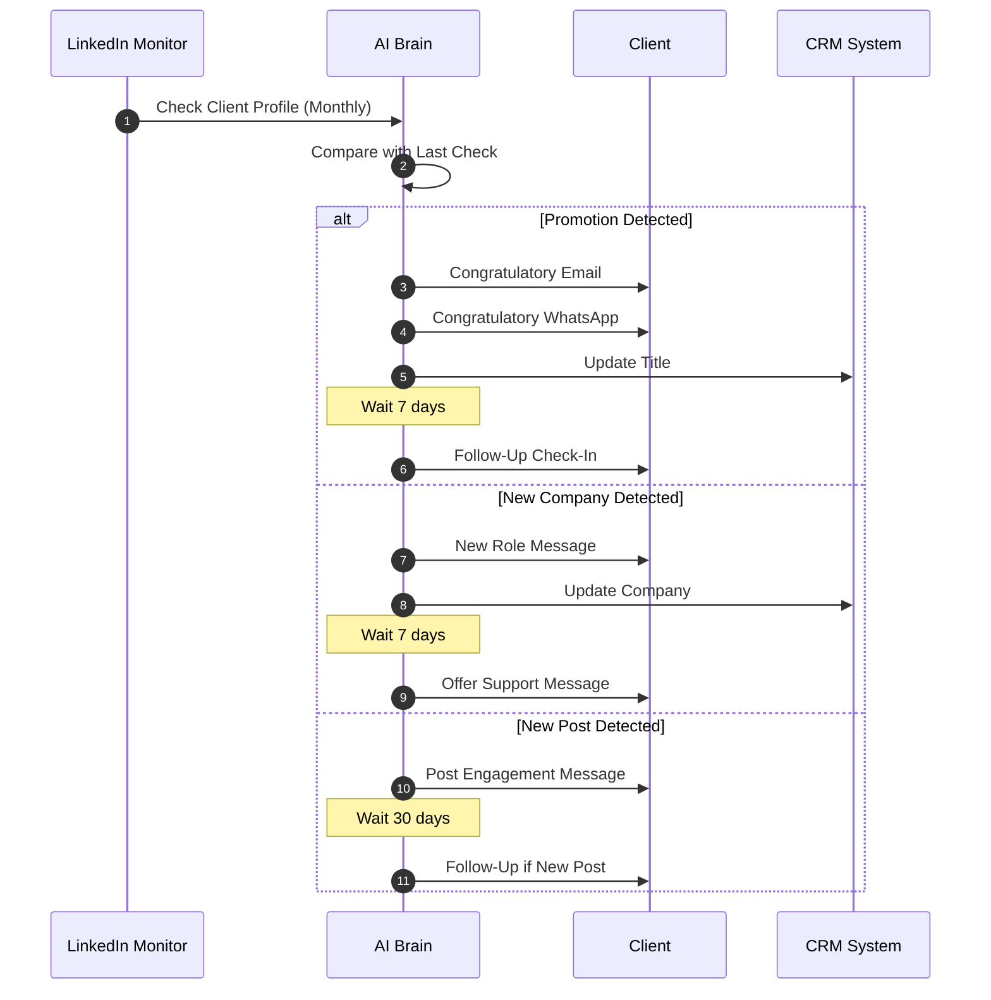
```mermaid
sequenceDiagram
    autonumber
    participant LI as LinkedIn Monitor
    participant SYS as AI Brain
    participant C as Client
    participant CRM as CRM System

    LI->>SYS: Check Client Profile (Monthly)
    SYS->>SYS: Compare with Last Check
    
    alt Promotion Detected
        SYS->>C: Congratulatory Email
        SYS->>C: Congratulatory WhatsApp
        SYS->>CRM: Update Title
        Note over SYS: Wait 7 days
        SYS->>C: Follow-Up Check-In
    else New Company Detected
        SYS->>C: New Role Message
        SYS->>CRM: Update Company
        Note over SYS: Wait 7 days
        SYS->>C: Offer Support Message
    else New Post Detected
        SYS->>C: Post Engagement Message
        Note over SYS: Wait 30 days
        SYS->>C: Follow-Up if New Post
    end
```

---

## Technology Stack

### Communication Layer
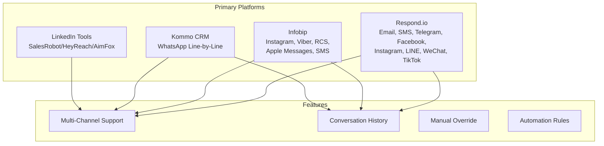
```mermaid
graph TB
    subgraph "Primary Platforms"
        R1[Respond.io<br/>Email, SMS, Telegram, Facebook,<br/>Instagram, LINE, WeChat, TikTok]
        I1[Infobip<br/>Instagram, Viber, RCS,<br/>Apple Messages, SMS]
        K1[Kommo CRM<br/>WhatsApp Line-by-Line]
        L1[LinkedIn Tools<br/>SalesRobot/HeyReach/AimFox]
    end
    
    subgraph "Features"
        F1[Multi-Channel Support]
        F2[Conversation History]
        F3[Manual Override]
        F4[Automation Rules]
    end
    
    R1 --> F1
    I1 --> F1
    K1 --> F1
    L1 --> F1
    
    R1 --> F2
    I1 --> F2
    K1 --> F2
```

### Data Storage
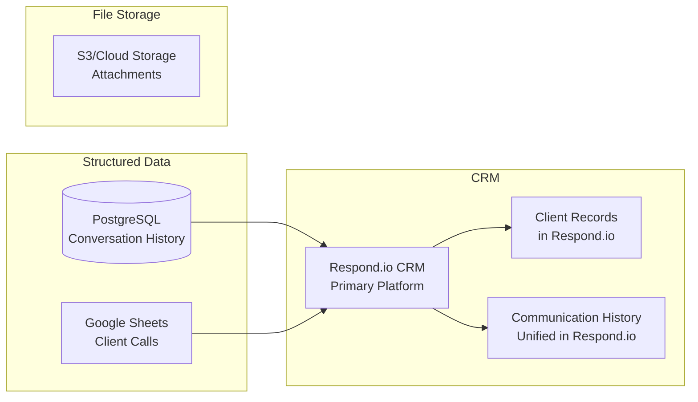
```mermaid
graph LR
    subgraph "Structured Data"
        D1[(PostgreSQL<br/>Conversation History)]
        D2[Google Sheets<br/>Client Calls]
    end
    
    subgraph "CRM"
        C1[Respond.io CRM<br/>Primary Platform]
        C2[Client Records<br/>in Respond.io]
        C3[Communication History<br/>Unified in Respond.io]
    end
    
    subgraph "File Storage"
        F1[S3/Cloud Storage<br/>Attachments]
    end
    
    D1 --> C1
    D2 --> C1
    C1 --> C2
    C1 --> C3
```

### Integration Services
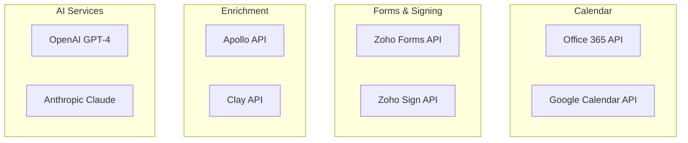
```mermaid
graph TB
    subgraph "Calendar"
        CAL1[Office 365 API]
        CAL2[Google Calendar API]
    end
    
    subgraph "Forms & Signing"
        Z1[Zoho Forms API]
        Z2[Zoho Sign API]
    end
    
    subgraph "Enrichment"
        E1[Apollo API]
        E2[Clay API]
    end
    
    subgraph "AI Services"
        AI1[OpenAI GPT-4]
        AI2[Anthropic Claude]
    end
```

---

## Integration Points

### Respond.io Integration Architecture

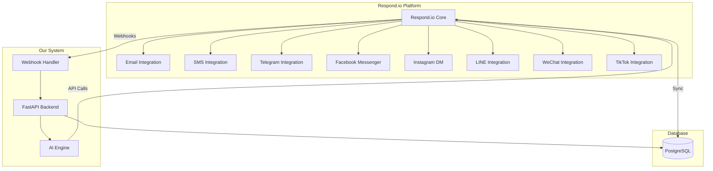
```mermaid
graph TB
    subgraph "Respond.io Platform"
        R1[Respond.io Core]
        R2[Email Integration]
        R3[SMS Integration]
        R4[Telegram Integration]
        R5[Facebook Messenger]
        R6[Instagram DM]
        R7[LINE Integration]
        R8[WeChat Integration]
        R9[TikTok Integration]
    end
    
    subgraph "Our System"
        S1[FastAPI Backend]
        S2[Webhook Handler]
        S3[AI Engine]
    end
    
    subgraph "Database"
        D1[(PostgreSQL)]
    end
    
    R1 --> R2
    R1 --> R3
    R1 --> R4
    R1 --> R5
    R1 --> R6
    R1 --> R7
    R1 --> R8
    R1 --> R9
    
    R1 -->|Webhooks| S2
    S2 --> S1
    S1 --> S3
    S3 -->|API Calls| R1
    
    S1 --> D1
    R1 -->|Sync| D1
```

### Multi-Channel Communication Hub

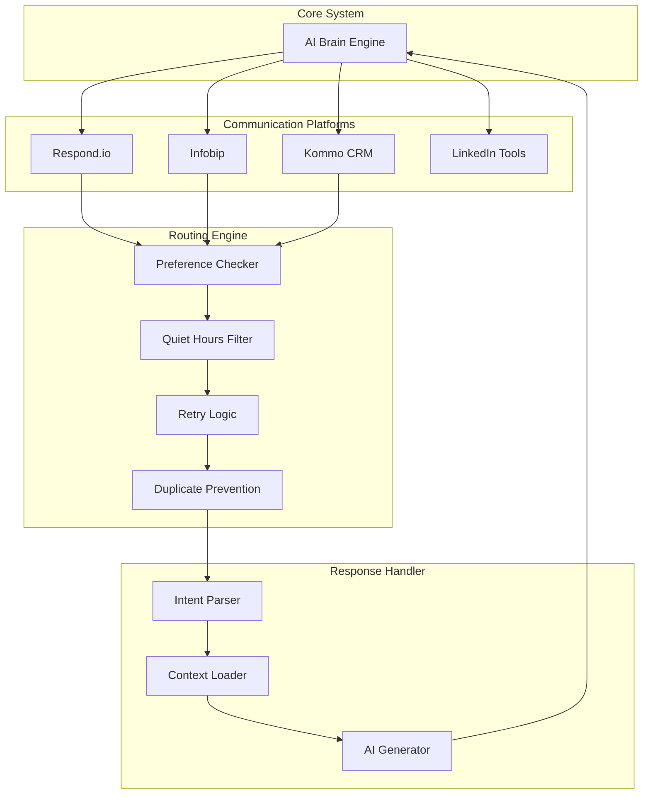
```mermaid
graph TB
    subgraph "Core System"
        CORE[AI Brain Engine]
    end
    
    subgraph "Communication Platforms"
        RESPOND[Respond.io]
        INFOBIP[Infobip]
        KOMMO[Kommo CRM]
        LINKEDIN[LinkedIn Tools]
    end
    
    subgraph "Routing Engine"
        RE1[Preference Checker]
        RE2[Quiet Hours Filter]
        RE3[Retry Logic]
        RE4[Duplicate Prevention]
    end
    
    subgraph "Response Handler"
        RH1[Intent Parser]
        RH2[Context Loader]
        RH3[AI Generator]
    end
    
    CORE --> RESPOND
    CORE --> INFOBIP
    CORE --> KOMMO
    CORE --> LINKEDIN
    
    RESPOND --> RE1
    INFOBIP --> RE1
    KOMMO --> RE1
    
    RE1 --> RE2
    RE2 --> RE3
    RE3 --> RE4
    
    RE4 --> RH1
    RH1 --> RH2
    RH2 --> RH3
    
    RH3 --> CORE
```

---

## Implementation Phases

### Phase 1: Foundation (Weeks 1-3)
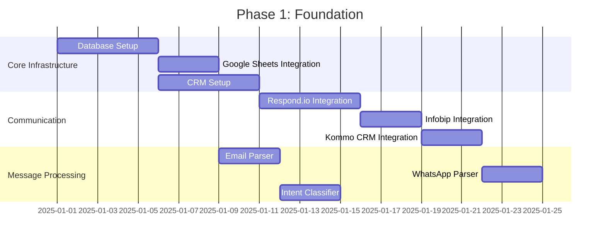
```mermaid
gantt
    title Phase 1: Foundation
    dateFormat YYYY-MM-DD
    section Core Infrastructure
    Database Setup           :a1, 2025-01-01, 5d
    Google Sheets Integration :a2, after a1, 3d
    CRM Setup                :a3, after a1, 5d
    section Communication
    Respond.io Integration   :b1, after a3, 5d
    Infobip Integration     :b2, after b1, 3d
    Kommo CRM Integration   :b3, after b2, 3d
    section Message Processing
    Email Parser            :c1, after a2, 3d
    WhatsApp Parser        :c2, after b3, 3d
    Intent Classifier      :c3, after c1, 3d
```

### Phase 2: Core Features (Weeks 4-6)
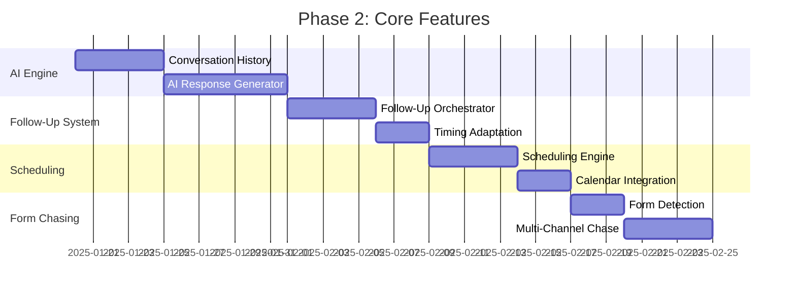
```mermaid
gantt
    title Phase 2: Core Features
    dateFormat YYYY-MM-DD
    section AI Engine
    Conversation History    :d1, 2025-01-20, 5d
    AI Response Generator   :d2, after d1, 7d
    section Follow-Up System
    Follow-Up Orchestrator  :e1, after d2, 5d
    Timing Adaptation      :e2, after e1, 3d
    section Scheduling
    Scheduling Engine      :f1, after e2, 5d
    Calendar Integration   :f2, after f1, 3d
    section Form Chasing
    Form Detection        :g1, after f2, 3d
    Multi-Channel Chase   :g2, after g1, 5d
```

### Phase 3: Advanced Features (Weeks 7-9)
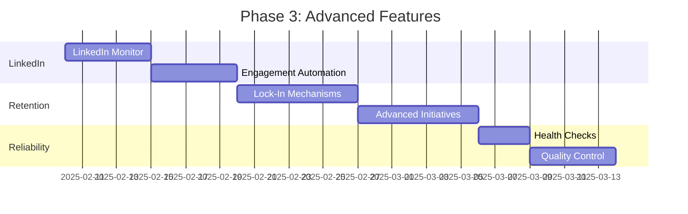
```mermaid
gantt
    title Phase 3: Advanced Features
    dateFormat YYYY-MM-DD
    section LinkedIn
    LinkedIn Monitor      :h1, 2025-02-10, 5d
    Engagement Automation :h2, after h1, 5d
    section Retention
    Lock-In Mechanisms   :i1, after h2, 7d
    Advanced Initiatives :i2, after i1, 7d
    section Reliability
    Health Checks        :j1, after i2, 3d
    Quality Control      :j2, after j1, 5d
```

### Phase 4: Dashboard & Optimization (Weeks 10-12)
```mermaid
gantt
    title Phase 4: Dashboard & Optimization
    dateFormat YYYY-MM-DD
    section Dashboard
    Admin UI            :k1, 2025-03-01, 7d
    Operations Dashboard :k2, after k1, 5d
    section Testing
    End-to-End Testing  :l1, after k2, 5d
    Performance Tuning :l2, after l1, 3d
```

---

## System Reliability & Failover

### Failure Recovery Architecture

```mermaid
graph TB
    subgraph "Primary System"
        P1[Email Service]
        P2[WhatsApp API]
        P3[LinkedIn API]
    end
    
    subgraph "Monitoring"
        M1[Health Checker]
        M2[Latency Monitor]
        M3[Error Tracker]
    end
    
    subgraph "Failover Logic"
        F1{Failure Detected?}
        F2[Backup Channel]
        F3[Retry Queue]
    end
    
    subgraph "Backup Systems"
        B1[Backup Email]
        B2[Backup WhatsApp]
        B3[Backup LinkedIn]
    end
    
    P1 --> M1
    P2 --> M2
    P3 --> M3
    
    M1 --> F1
    M2 --> F1
    M3 --> F1
    
    F1 -->|Yes| F2
    F1 -->|No| P1
    
    F2 --> B1
    F2 --> B2
    F2 --> B3
    
    F2 --> F3
    F3 -->|Retry| P1
```

---

## Security & Compliance

### Data Protection Architecture

```mermaid
graph TB
    subgraph "Access Control"
        AC1[Authentication]
        AC2[Authorization]
        AC3[Role-Based Access]
    end
    
    subgraph "Data Encryption"
        DE1[Encryption at Rest]
        DE2[Encryption in Transit]
        DE3[Key Management]
    end
    
    subgraph "Privacy Controls"
        PC1[Opt-out Management]
        PC2[Data Retention]
        PC3[GDPR Compliance]
    end
    
    subgraph "Audit Trail"
        AT1[Action Logging]
        AT2[Change Tracking]
        AT3[Compliance Reports]
    end
    
    AC1 --> DE1
    AC2 --> DE2
    AC3 --> DE3
    
    DE1 --> PC1
    DE2 --> PC2
    DE3 --> PC3
    
    PC1 --> AT1
    PC2 --> AT2
    PC3 --> AT3
```

---

## Monitoring & Analytics

### System Health Dashboard

```mermaid
graph TB
    subgraph "Metrics Collection"
        MC1[Message Success Rate]
        MC2[Response Times]
        MC3[Error Rates]
        MC4[Channel Performance]
    end
    
    subgraph "Alerting"
        AL1[Threshold Alerts]
        AL2[Anomaly Detection]
        AL3[Escalation Rules]
    end
    
    subgraph "Analytics"
        AN1[Client Engagement]
        AN2[Follow-Up Performance]
        AN3[Form Completion Rate]
        AN4[Retention Metrics]
    end
    
    subgraph "Reporting"
        RP1[Daily Reports]
        RP2[Weekly Summaries]
        RP3[Custom Dashboards]
    end
    
    MC1 --> AL1
    MC2 --> AL2
    MC3 --> AL3
    MC4 --> AL1
    
    MC1 --> AN1
    MC2 --> AN2
    MC3 --> AN3
    MC4 --> AN4
    
    AN1 --> RP1
    AN2 --> RP2
    AN3 --> RP3
    AN4 --> RP1
```

---

## Next Steps

1. **Review and validate** this architecture with stakeholders
2. **Prioritize components** based on business value
3. **Set up development environment** with core infrastructure
4. **Begin Phase 1 implementation** starting with database and communication integrations
5. **Establish monitoring** from day one to track system health

---

## Notes

- All communication channels must respect quiet hours (8pm-9am local time)
- Email can be sent during quiet hours, but WhatsApp/LinkedIn cannot
- All opt-out preferences must be permanently stored and enforced
- Timezone management is critical - always convert and confirm
- Every automation must have a fallback mechanism
- All data changes must be logged for audit purposes
- Conversation history is stored in our database for AI memory, synced with Respond.io/Infobip for unified view

