# Silverlight Expert Network - Complete System Architecture

## 📋 Table of Contents
1. [System Overview](#system-overview)
2. [High-Level Architecture](#high-level-architecture)
3. [Core Components](#core-components)
4. [Data Flow Diagrams](#data-flow-diagrams)
5. [Key Workflows](#key-workflows)
6. [Technology Stack](#technology-stack)
7. [Integration Points](#integration-points)
8. [Implementation Phases](#implementation-phases)

---

## System Overview

The Silverlight Expert Network is an end-to-end automated platform that manages the complete lifecycle of expert-client interactions, from initial project intake through expert sourcing, call scheduling, execution, payment, and long-term relationship management.

### Core Capabilities
- **Multi-channel communication** (Email, WhatsApp, LinkedIn, SMS, AI Voice)
- **Intelligent expert matching** and sourcing
- **Automated scheduling** with timezone management
- **AI-powered transcription** and summarization
- **Payment automation** and revenue tracking
- **Client retention** through knowledge continuity

---

## High-Level Architecture

```mermaid
graph TB
    subgraph "Client Entry Points"
        CE1[Email<br/>client-team@silverlink.ai]
        CE2[WhatsApp<br/>via Kommo/Respond.io]
        CE3[AI Avatar<br/>Anam]
        CE4[LinkedIn<br/>SalesRobot/HeyReach]
    end

    subgraph "Core Processing Layer"
        PI[Project Intake<br/>Engine]
        ES[Expert Sourcing<br/>Engine]
        CS[Call Scheduling<br/>Engine]
        PM[Payment Management<br/>Engine]
        AI[AI Orchestration<br/>Layer]
    end

    subgraph "Communication Layer - Respond.io Hub"
        RESPOND[Respond.io Platform<br/>Primary Communication Hub]
        WA[WhatsApp Business<br/>via Respond.io]
        EMAIL[Email Integration<br/>via Respond.io]
        SMS[SMS Service<br/>via Respond.io]
        TELEGRAM[Telegram<br/>via Respond.io]
        FACEBOOK[Facebook Messenger<br/>via Respond.io]
        INSTAGRAM[Instagram DM<br/>via Respond.io]
        LI[LinkedIn Automation<br/>SalesRobot/HeyReach]
        AI_CALL[AI Voice Caller<br/>External API]
    end

    subgraph "Data Storage"
        GS[Google Sheets<br/>Projects/Experts/Revenue]
        CRM[Respond.io CRM<br/>Primary CRM Platform]
        DB[(PostgreSQL<br/>Structured Data)]
        STORAGE[Cloud Storage<br/>Transcripts/Recordings]
    end

    subgraph "External Services"
        ZOOM[Zoom API<br/>Meeting Links]
        CAL[Office 365<br/>Calendar API]
        VEEM[Veem<br/>Payment API]
        TRANSCRIBE[Transcription<br/>Service]
    end

    subgraph "Expert Entry Points"
        EE1[Expert Signup Form]
        EE2[LinkedIn Scraping]
        EE3[Referral System]
        EE4[Direct Invitation]
    end

    CE1 --> PI
    CE2 --> PI
    CE3 --> PI
    CE4 --> PI

    PI --> ES
    ES --> CS
    CS --> PM

    PI --> AI
    ES --> AI
    CS --> AI
    PM --> AI

    AI --> RESPOND
    RESPOND --> WA
    RESPOND --> EMAIL
    RESPOND --> SMS
    RESPOND --> TELEGRAM
    RESPOND --> FACEBOOK
    RESPOND --> INSTAGRAM
    AI --> LI
    AI --> AI_CALL

    PI --> GS
    ES --> GS
    CS --> GS
    PM --> GS

    AI --> CRM
    CS --> ZOOM
    CS --> CAL
    PM --> VEEM
    CS --> TRANSCRIBE

    EE1 --> ES
    EE2 --> ES
    EE3 --> ES
    EE4 --> ES

    TRANSCRIBE --> STORAGE
    GS --> DB
    CRM --> DB
```

---

## Core Components

### 1. Project Intake Engine

**Purpose**: Process incoming client requests and create/manage project records

**Key Functions**:
- Email parsing and classification
- Duplicate project detection
- Briefing completeness validation
- Project record creation
- Client preference tracking

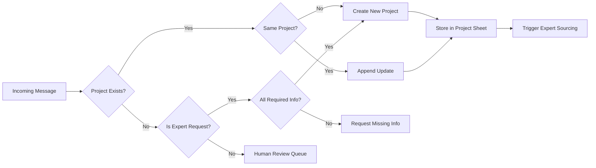

### 2. Expert Sourcing Engine

**Purpose**: Find and match experts to project requirements

**Key Functions**:
- Database search (existing network)
- Fresh expert sourcing
- Industry-side classification
- Compatibility scoring
- Expert invitation automation

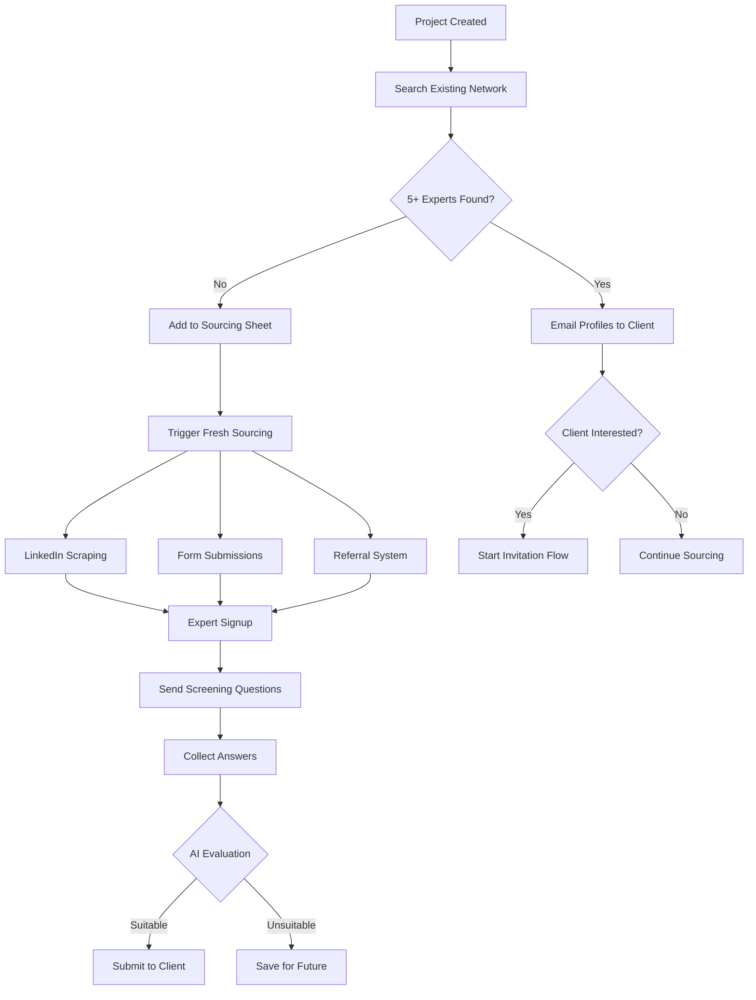

### 3. Communication Orchestration Layer

**Purpose**: Manage multi-channel communication with intelligent routing

**Key Functions**:
- Channel preference management
- Quiet hours enforcement
- Retry logic with escalation
- Timezone conversion
- Opt-out handling

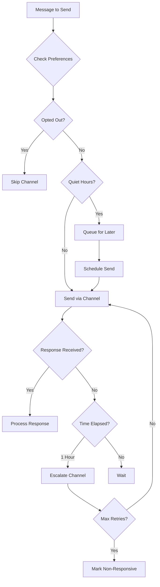

### 4. Call Scheduling Engine

**Purpose**: Automate meeting coordination and calendar management

**Key Functions**:
- Availability collection
- Timezone reconciliation
- Slot proposal generation
- Calendar invite creation
- Reminder automation

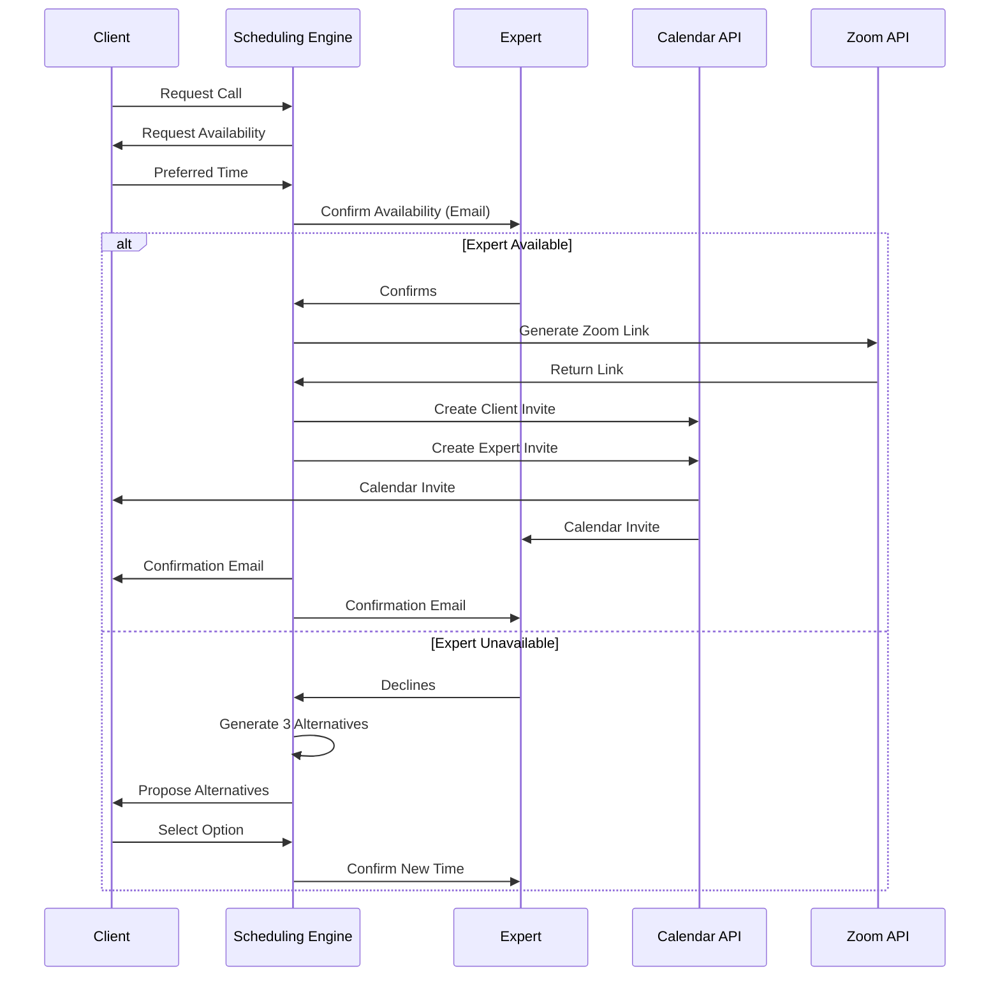

### 5. Payment Management Engine

**Purpose**: Calculate fees, process payments, and maintain revenue records

**Key Functions**:
- Fee calculation from formulas
- Call duration confirmation
- Payment approval workflow
- Veem integration
- Revenue logging

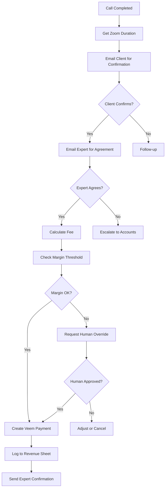

---

## Data Flow Diagrams

### Project Lifecycle Data Flow

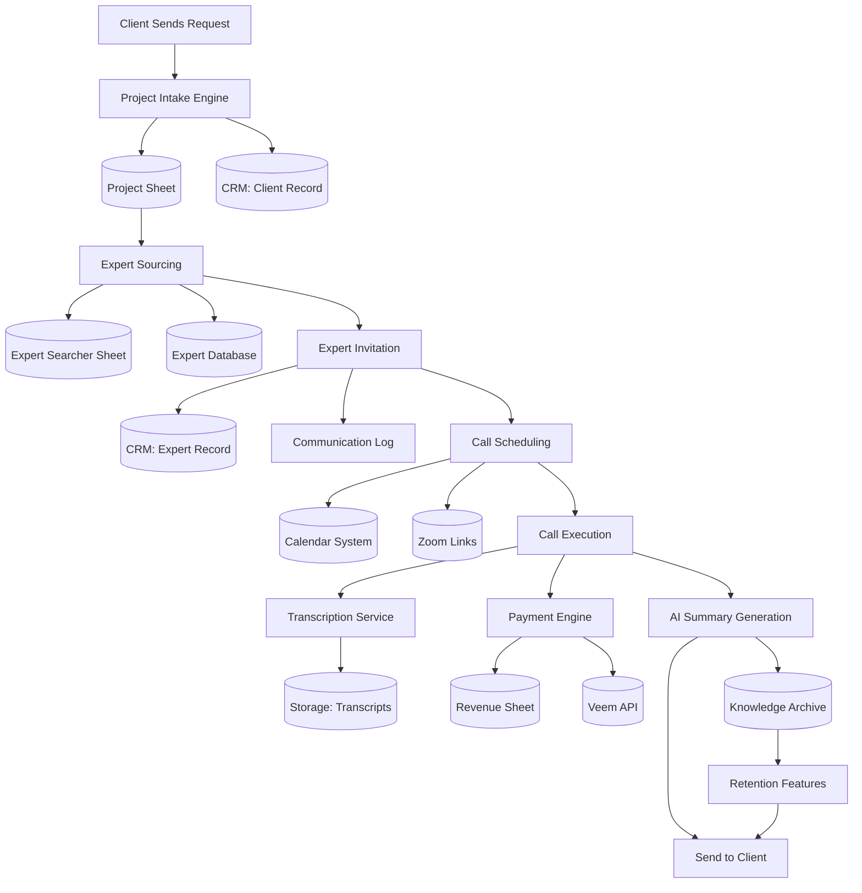

### Communication Channel Data Flow

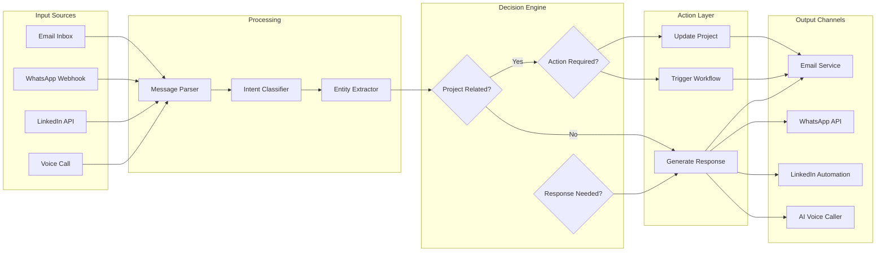

---

## Key Workflows

### Workflow 1: Complete Project Intake to Expert Submission

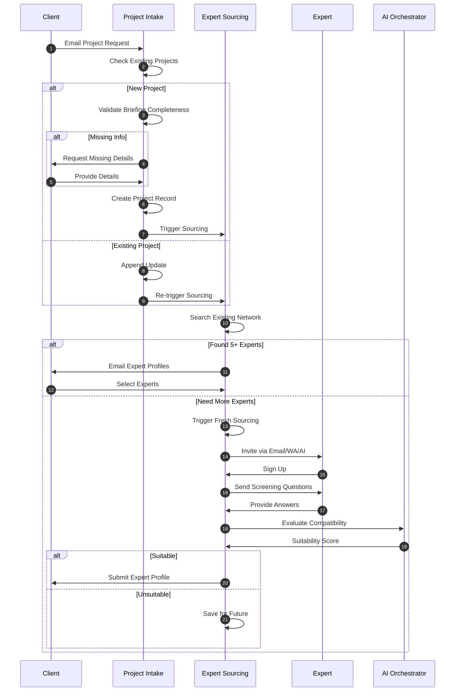

### Workflow 2: Expert Invitation to Call Booking

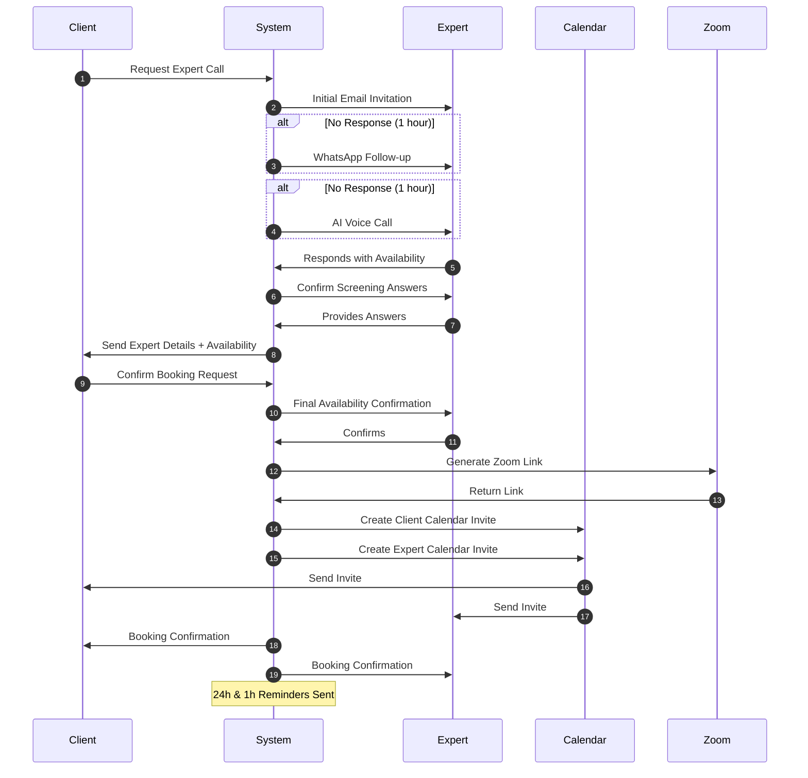

### Workflow 3: Call Execution to Payment

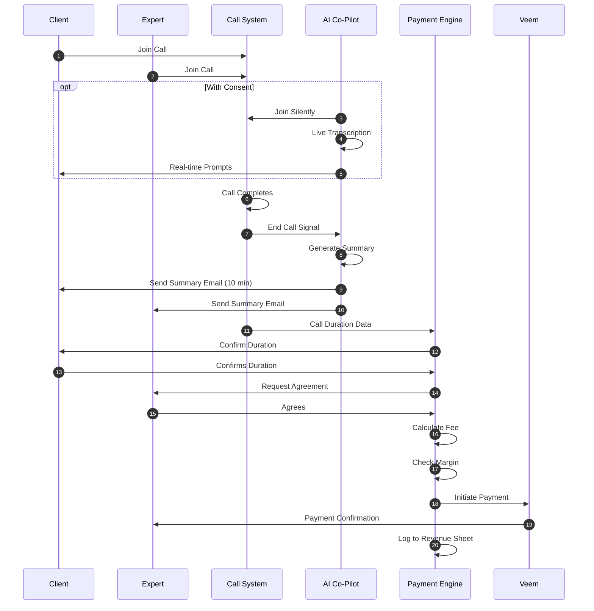

---

## Technology Stack

### Communication Layer - Respond.io Centric
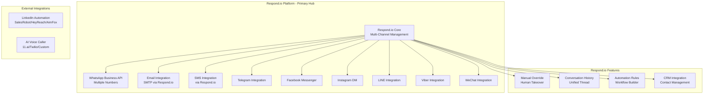

### Data Storage
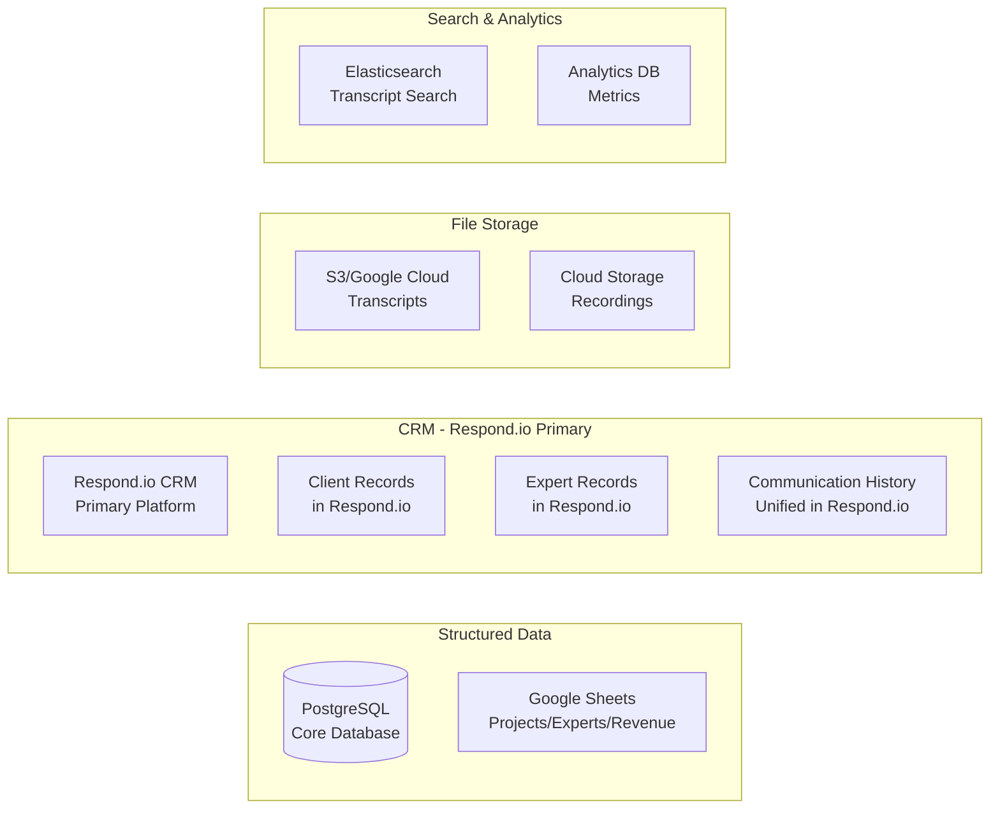

### Integration Services
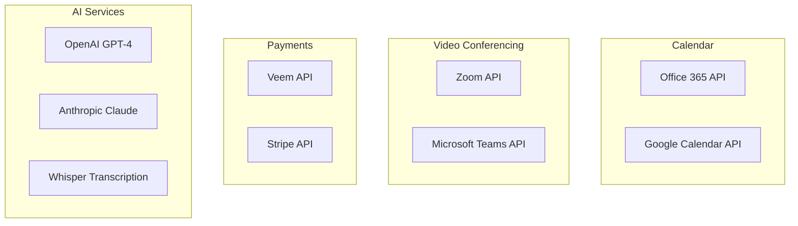

---

## Integration Points

### Respond.io CRM Integration Architecture

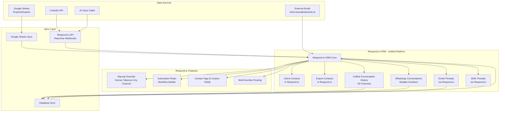

### Respond.io Multi-Channel Communication Hub

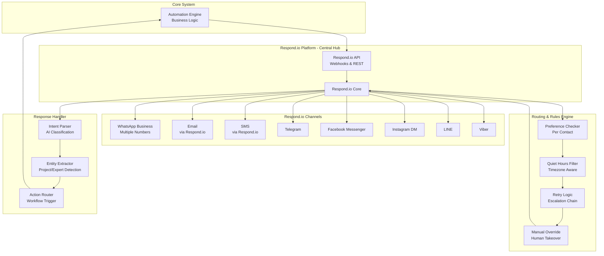

---

## Implementation Phases

### Phase 1: Foundation (Weeks 1-4)
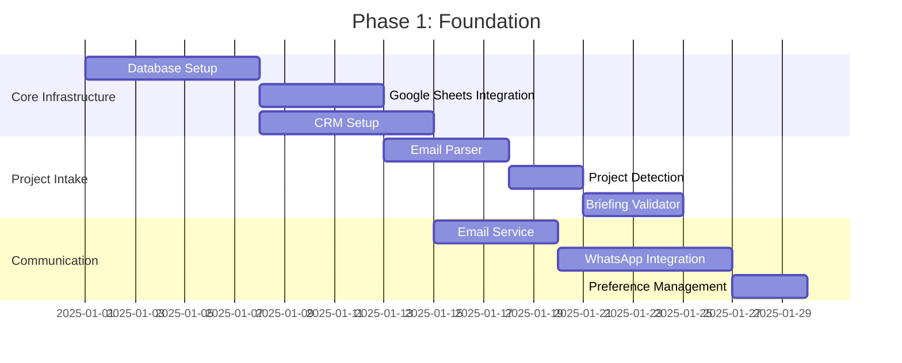

### Phase 2: Expert Sourcing (Weeks 5-8)
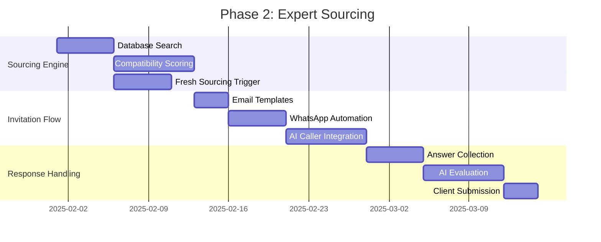

### Phase 3: Scheduling & Calls (Weeks 9-12)
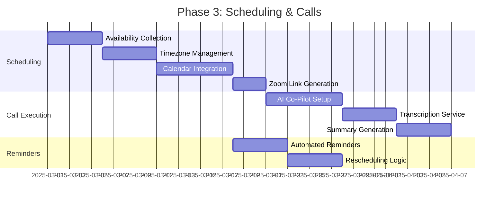

### Phase 4: Payments & Records (Weeks 13-16)
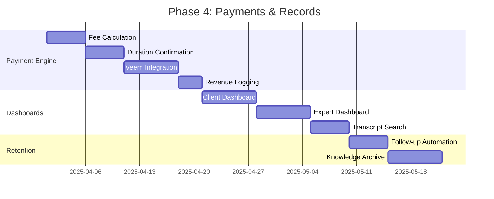

### Phase 5: Advanced AI & Optimization (Weeks 17-20)
```mermaid
gantt
    title Phase 5: Advanced Features
    dateFormat YYYY-MM-DD
    section AI Features
    Predictive Matching     :m1, 2025-05-01, 7d
    Smart Recommendations   :m2, after m1, 7d
    Sentiment Analysis      :m3, after m2, 5d
    section Optimization
    Retry Logic Optimization :n1, after m3, 5d
    Performance Monitoring  :n2, after n1, 5d
    Auto-recovery Systems   :n3, after n2, 7d
    section Retention
    Client Lock Mechanisms  :o1, after n3, 7d
    Knowledge Continuity    :o2, after o1, 7d
```

---

## System Reliability & Failover

### Failure Recovery Architecture

```mermaid
graph TB
    subgraph "Primary System"
        P1[Email Service]
        P2[WhatsApp API]
        P3[AI Caller]
    end
    
    subgraph "Monitoring"
        M1[Health Checker]
        M2[Latency Monitor]
        M3[Error Tracker]
    end
    
    subgraph "Failover Logic"
        F1{Failure Detected?}
        F2[Backup Channel]
        F3[Retry Queue]
    end
    
    subgraph "Backup Systems"
        B1[Backup Email]
        B2[Backup WhatsApp]
        B3[Backup Voice]
    end
    
    P1 --> M1
    P2 --> M2
    P3 --> M3
    
    M1 --> F1
    M2 --> F1
    M3 --> F1
    
    F1 -->|Yes| F2
    F1 -->|No| P1
    
    F2 --> B1
    F2 --> B2
    F2 --> B3
    
    F2 --> F3
    F3 -->|Retry| P1
```

### Data Consistency Checks

```mermaid
graph LR
    subgraph "Data Sources"
        DS1[Google Sheets]
        DS2[CRM]
        DS3[Database]
    end
    
    subgraph "Validation Engine"
        V1[Schema Validator]
        V2[Duplicate Checker]
        V3[Referential Integrity]
    end
    
    subgraph "Sync Service"
        S1[Real-time Sync]
        S2[Conflict Resolver]
        S3[Audit Logger]
    end
    
    DS1 --> V1
    DS2 --> V2
    DS3 --> V3
    
    V1 --> S1
    V2 --> S1
    V3 --> S1
    
    S1 --> S2
    S2 --> S3
```

---

## Security & Compliance

### Data Protection Architecture

```mermaid
graph TB
    subgraph "Access Control"
        AC1[Authentication]
        AC2[Authorization]
        AC3[Role-Based Access]
    end
    
    subgraph "Data Encryption"
        DE1[Encryption at Rest]
        DE2[Encryption in Transit]
        DE3[Key Management]
    end
    
    subgraph "Privacy Controls"
        PC1[Opt-out Management]
        PC2[Data Retention]
        PC3[GDPR Compliance]
    end
    
    subgraph "Audit Trail"
        AT1[Action Logging]
        AT2[Change Tracking]
        AT3[Compliance Reports]
    end
    
    AC1 --> DE1
    AC2 --> DE2
    AC3 --> DE3
    
    DE1 --> PC1
    DE2 --> PC2
    DE3 --> PC3
    
    PC1 --> AT1
    PC2 --> AT2
    PC3 --> AT3
```

---

## Monitoring & Analytics

### System Health Dashboard

```mermaid
graph TB
    subgraph "Metrics Collection"
        MC1[Automation Success Rate]
        MC2[Response Times]
        MC3[Error Rates]
        MC4[Channel Performance]
    end
    
    subgraph "Alerting"
        AL1[Threshold Alerts]
        AL2[Anomaly Detection]
        AL3[Escalation Rules]
    end
    
    subgraph "Analytics"
        AN1[Project Metrics]
        AN2[Expert Performance]
        AN3[Client Engagement]
        AN4[Revenue Analytics]
    end
    
    subgraph "Reporting"
        RP1[Daily Reports]
        RP2[Weekly Summaries]
        RP3[Custom Dashboards]
    end
    
    MC1 --> AL1
    MC2 --> AL2
    MC3 --> AL3
    MC4 --> AL1
    
    MC1 --> AN1
    MC2 --> AN2
    MC3 --> AN3
    MC4 --> AN4
    
    AN1 --> RP1
    AN2 --> RP2
    AN3 --> RP3
    AN4 --> RP1
```

---

## API Architecture

### RESTful API Structure

```mermaid
graph TB
    subgraph "API Gateway"
        AG[API Gateway<br/>Authentication & Routing]
    end
    
    subgraph "Core APIs"
        API1[Projects API<br/>/api/v1/projects]
        API2[Experts API<br/>/api/v1/experts]
        API3[Calls API<br/>/api/v1/calls]
        API4[Payments API<br/>/api/v1/payments]
    end
    
    subgraph "Communication APIs"
        API5[Messages API<br/>/api/v1/messages]
        API6[Notifications API<br/>/api/v1/notifications]
    end
    
    subgraph "Analytics APIs"
        API7[Reports API<br/>/api/v1/reports]
        API8[Metrics API<br/>/api/v1/metrics]
    end
    
    AG --> API1
    AG --> API2
    AG --> API3
    AG --> API4
    AG --> API5
    AG --> API6
    AG --> API7
    AG --> API8
```

---

## Deployment Architecture

### Cloud Infrastructure

```mermaid
graph TB
    subgraph "Load Balancer"
        LB[Application Load Balancer]
    end
    
    subgraph "Application Tier"
        APP1[API Server 1]
        APP2[API Server 2]
        APP3[API Server N]
    end
    
    subgraph "Worker Tier"
        W1[Background Workers]
        W2[Email Workers]
        W3[Communication Workers]
    end
    
    subgraph "Data Tier"
        DB1[(Primary DB)]
        DB2[(Replica DB)]
        CACHE[Redis Cache]
    end
    
    subgraph "Storage"
        S3[S3/Cloud Storage]
        FILES[File Storage]
    end
    
    LB --> APP1
    LB --> APP2
    LB --> APP3
    
    APP1 --> DB1
    APP2 --> DB1
    APP3 --> DB1
    
    DB1 --> DB2
    
    APP1 --> CACHE
    APP2 --> CACHE
    APP3 --> CACHE
    
    W1 --> DB1
    W2 --> DB1
    W3 --> DB1
    
    APP1 --> S3
    W1 --> FILES
```

---

## Next Steps

1. **Review and validate** this architecture with stakeholders
2. **Prioritize components** based on business value
3. **Set up development environment** with core infrastructure
4. **Begin Phase 1 implementation** starting with database and Google Sheets integration
5. **Establish monitoring** from day one to track system health

---

## Notes

- All communication channels must respect quiet hours (8pm-9am local time)
- Email can be sent during quiet hours, but WhatsApp/AI calls cannot
- All opt-out preferences must be permanently stored and enforced
- Timezone management is critical - always convert and confirm
- Every automation must have a fallback mechanism
- All data changes must be logged for audit purposes

