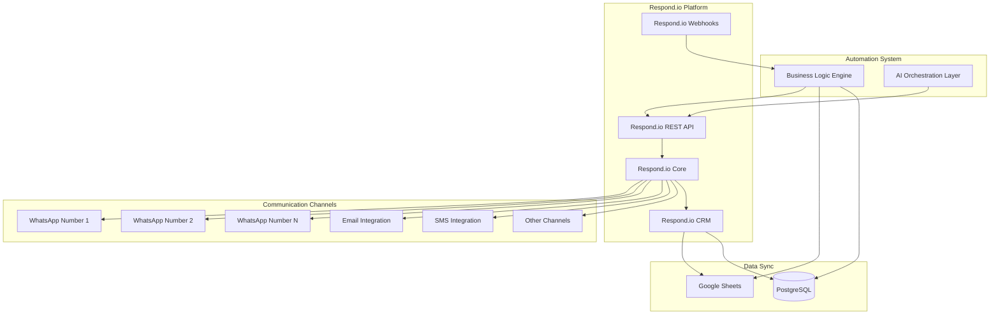
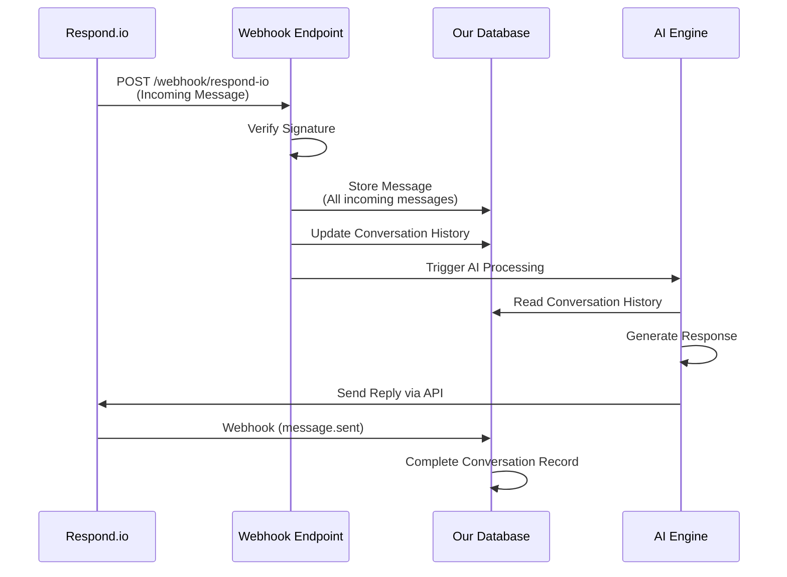
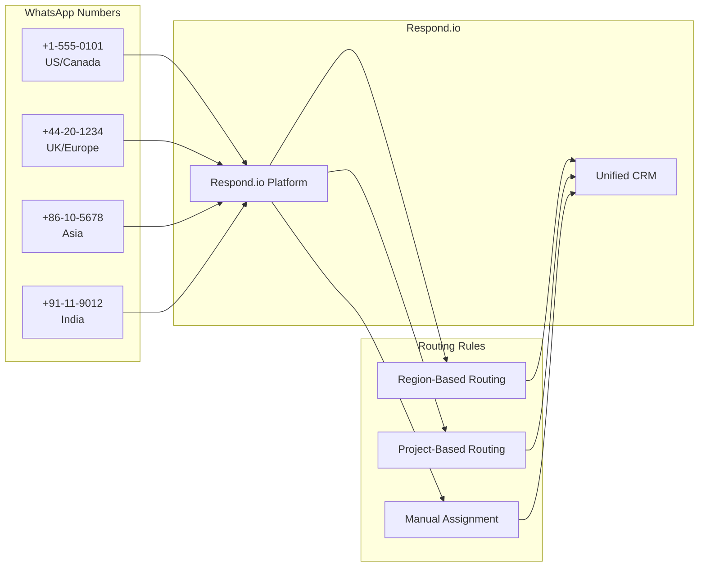
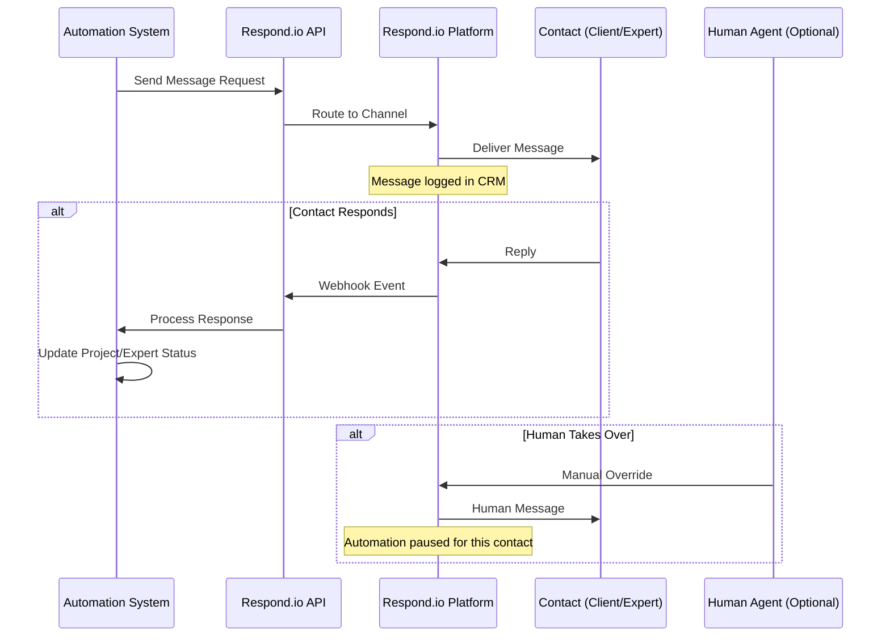
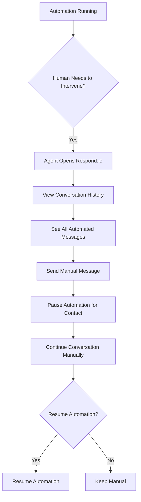
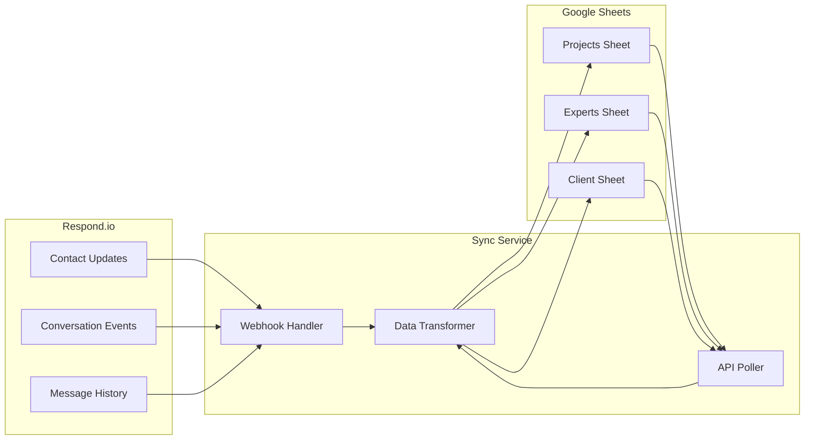
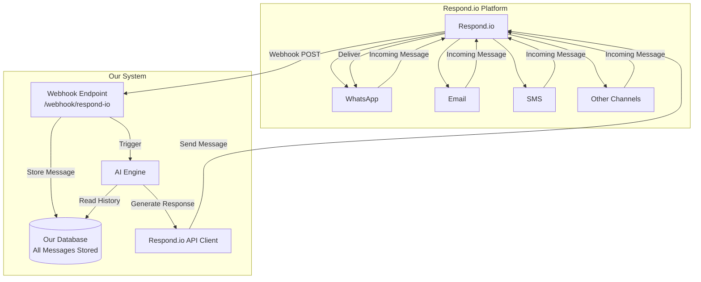

# Respond.io Integration Guide

## 🎯 Respond.io as Primary Platform

Respond.io will serve as the **central communication hub** for the entire Silverlight Expert Network system, handling all client and expert communications across multiple channels.

---

## 📋 Key Requirements

### 1. Multi-Channel Support via Respond.io
- ✅ **WhatsApp Business** (multiple numbers)
- ✅ **Email** (via Respond.io SMTP)
- ✅ **SMS** (via Respond.io)
- ✅ **Telegram**
- ✅ **Facebook Messenger**
- ✅ **Instagram DM**
- ✅ **LINE**
- ✅ **Viber**
- ✅ **WeChat**

### 2. Multi-WhatsApp Number Support
- Support for **multiple WhatsApp Business numbers**
- Each number can be assigned to different regions/projects
- Unified conversation history across all numbers
- Manual override capability for each number

### 3. CRM Functionality
- **Client records** in Respond.io
- **Expert records** in Respond.io
- **Unified conversation history** (all channels in one thread)
- **Custom fields** for project tracking, preferences, etc.
- **Tags** for categorization (Client, Expert, Project Status, etc.)

### 4. Manual Override Capability
- Human agents can **take over any conversation** at any time
- Send manual messages via WhatsApp AND Email through Respond.io
- All automations visible in conversation history
- Ability to pause/resume automations per contact

---

## 🏗️ Architecture Overview



---

## 🔌 Integration Points

### 1. Respond.io API Integration

#### API Documentation
- **Official Docs**: https://developers.respond.io
- **API v2 Docs**: https://developers.respond.io/docs/api
- **Base URL**: `https://api.respond.io/v2`
- **Protocol**: HTTPS only
- **Format**: RESTful API (GET, POST, PUT, DELETE)
- **Request/Response**: JSON

#### Authentication
```python
# Respond.io API Configuration
RESPOND_IO_API_KEY = "your_api_access_token"  # Generate in Settings > Integration > Developer API
RESPOND_IO_BASE_URL = "https://api.respond.io/v2"

# Authentication Header
headers = {
    "Authorization": f"Bearer {RESPOND_IO_API_KEY}",
    "Content-Type": "application/json"
}
```

**How to Get API Key:**
1. Go to Respond.io workspace
2. Navigate to: **Settings** > **Integration** > **Developer API**
3. Generate new Access Token
4. You can create up to **10 access tokens** per workspace

#### Complete API Endpoints

**Messages:**
- `POST /contact/{identifier}/message` - Send message (10 req/sec)
- `GET /contact/{identifier}/message/{messageId}` - Get specific message (15 req/sec)

**Contacts:**
- `GET /contact/{identifier}` - Get contact details (10 req/sec)
- `POST /contact/{identifier}` - Create/update contact (5 req/sec)
- `GET /contact/list` - List all contacts (5 req/sec)
- `POST /contact/merge` - Merge two contacts (5 req/sec)
- `POST /contact/create_or_update/{identifier}` - Create or update contact (5 req/sec)

**Conversations:**
- `POST /contact/{identifier}/conversation/assignee` - Assign/unassign conversation (5 req/sec)
- `POST /contact/{identifier}/conversation/status` - Open/close conversation (5 req/sec)

**Channels:**
- `GET /contact/{identifier}/channels` - List contact channels (5 req/sec)
- `GET /contact/{identifier}/channel/{channelId}` - Get specific channel (10 req/sec)

**Comments:**
- `POST /contact/{identifier}/comment` - Create comment (10 req/sec)

**Tags:**
- `POST /contact/{identifier}/tag` - Add/delete tags (5 req/sec)

**Space/Workspace:**
- `GET /space/channel` - List space channels (5 req/sec)
- `GET /space/user` - List space users (5 req/sec)
- `GET /space/user/{id}` - Get space user (10 req/sec)
- `GET /space/contact_field` - List custom fields (5 req/sec)
- `POST /space/contact_field` - Create custom field (5 req/sec)
- `GET /space/contact_field/{id}` - Get custom field (10 req/sec)

#### Rate Limiting
- **Rate limits vary by endpoint** (5-15 requests per second)
- Response headers include:
  - `X-RateLimit-Limit` - Total requests allowed
  - `X-RateLimit-Remaining` - Requests remaining
  - `Retry-After` - Seconds until retry (when rate limited)
- **429 status code** when rate limit exceeded
- Contact Respond.io to increase limits if needed

#### Pagination
- Cursor-based pagination for list endpoints
- Parameters:
  - `cursorId` (optional) - Cursor from previous response
  - `limit` (optional) - Items per page (default: 10, max: 100)

---

### 2. Webhook Configuration (CRITICAL: All Incoming Messages)

**Webhook Documentation**: https://developers.respond.io/docs/webhooks

#### Why Webhooks Are Essential
- **Real-time event notifications** from Respond.io
- **All incoming messages** are pushed to our system instantly
- No need to poll API - webhooks push data directly
- **Every message is stored in our database** for AI processing and memory

#### Webhook Setup

**1. Configure Webhook in Respond.io:**
- Go to: **Settings** > **Integration** > **Webhooks**
- Add webhook URL: `https://your-domain.com/webhook/respond-io`
- Select events to subscribe to
- Set signing secret for security

**2. Webhook Security:**
- HTTPS required
- Signing secret for verification
- Verify webhook signature before processing

**3. Events We Subscribe To:**
- ✅ `message.received` - **All incoming messages** (WhatsApp, Email, SMS, etc.)
- ✅ `message.sent` - Outgoing messages (for tracking)
- ✅ `contact.created` - New contact created
- ✅ `contact.updated` - Contact data changed
- ✅ `conversation.updated` - Conversation status changed
- ✅ `conversation.assigned` - Conversation assigned to agent

#### Webhook Payload Examples

**Incoming Message Webhook (Most Important):**
```json
{
  "event": "message.received",
  "timestamp": "2025-01-15T10:30:00Z",
  "data": {
    "messageId": "msg_123456",
    "contactId": "contact_456",
    "channelId": "channel_789",
    "channel": "whatsapp",
    "conversationId": "conv_123",
    "message": {
      "text": "Hello, I need experts for automotive project",
      "type": "text",
      "timestamp": "2025-01-15T10:30:00Z",
      "direction": "inbound"
    },
    "contact": {
      "identifier": "+1234567890",
      "name": "John Doe",
      "email": "john@example.com"
    }
  }
}
```

**Contact Update Webhook:**
```json
{
  "event": "contact.updated",
  "timestamp": "2025-01-15T10:30:00Z",
  "data": {
    "contactId": "contact_456",
    "identifier": "+1234567890",
    "customFields": {
      "project_id": "proj_789",
      "expert_id": "exp_321",
      "timezone": "America/New_York",
      "preferences": {
        "no_whatsapp": false,
        "no_ai_calls": false,
        "quiet_hours": "20:00-09:00"
      }
    },
    "tags": ["client", "active_project", "us"]
  }
}
```

**Conversation Update Webhook:**
```json
{
  "event": "conversation.updated",
  "timestamp": "2025-01-15T10:30:00Z",
  "data": {
    "conversationId": "conv_123",
    "contactId": "contact_456",
    "status": "open",
    "assigneeId": "user_789",
    "channel": "whatsapp"
  }
}
```

#### Webhook Processing Flow



**Key Point:** Every incoming message from Respond.io (via webhook) is **immediately stored in our database** for:
- AI memory and personalization
- Conversation history retrieval
- Analytics and reporting
- Long-term relationship tracking

---

## 📱 Multi-WhatsApp Number Setup

### Configuration Structure



### Implementation

```python
# WhatsApp Number Configuration
WHATSAPP_NUMBERS = {
    "us_canada": {
        "number": "+15550101",
        "respond_io_channel_id": "channel_123",
        "regions": ["US", "CA"],
        "timezone": "America/New_York"
    },
    "uk_europe": {
        "number": "+44201234",
        "respond_io_channel_id": "channel_456",
        "regions": ["GB", "DE", "FR", "IT"],
        "timezone": "Europe/London"
    },
    "asia": {
        "number": "+86105678",
        "respond_io_channel_id": "channel_789",
        "regions": ["CN", "JP", "KR", "SG"],
        "timezone": "Asia/Shanghai"
    },
    "india": {
        "number": "+91119012",
        "respond_io_channel_id": "channel_012",
        "regions": ["IN"],
        "timezone": "Asia/Kolkata"
    }
}

def get_whatsapp_number_for_contact(contact):
    """Determine which WhatsApp number to use based on contact location"""
    region = contact.get("region") or contact.get("country")
    
    for key, config in WHATSAPP_NUMBERS.items():
        if region in config["regions"]:
            return config["respond_io_channel_id"]
    
    # Default to first number
    return WHATSAPP_NUMBERS["us_canada"]["respond_io_channel_id"]
```

---

## 💬 Communication Flow

### Automated Message Flow



### Manual Override Flow



---

## 🗄️ CRM Data Structure in Respond.io

### Contact Custom Fields

```python
# Client Contact Fields
CLIENT_FIELDS = {
    "client_id": "text",
    "company_domain": "text",  # e.g., "@amazon.com"
    "timezone": "text",  # e.g., "America/New_York"
    "project_ids": "text",  # Comma-separated
    "communication_preferences": "json",  # {
        #   "no_whatsapp": false,
        #   "no_ai_calls": false,
        #   "preferred_channels": ["email", "whatsapp"],
        #   "quiet_hours": "20:00-09:00"
    # }
    "last_project_date": "date",
    "total_calls": "number",
    "status": "text"  # "active", "inactive", "opted_out"
}

# Expert Contact Fields
EXPERT_FIELDS = {
    "expert_id": "text",
    "rate_per_hour": "number",
    "currency": "text",
    "expertise_areas": "text",  # Comma-separated
    "companies_worked_for": "text",
    "geography": "text",
    "timezone": "text",
    "availability_status": "text",  # "available", "busy", "unavailable"
    "project_ids": "text",
    "communication_preferences": "json",
    "payment_status": "text",
    "reliability_score": "number"
}
```

### Tags System

```python
# Contact Tags
TAGS = {
    "type": ["client", "expert"],
    "project_status": ["active_project", "completed_project", "pending_project"],
    "urgency": ["urgent", "normal", "low_priority"],
    "channel_preference": ["email_only", "whatsapp_preferred", "ai_call_ok"],
    "region": ["us", "europe", "asia", "india"],
    "industry": ["automotive", "healthcare", "tech", "finance"]
}
```

---

## 🔄 Synchronization with Google Sheets

### Two-Way Sync



### Sync Logic

```python
def sync_respond_io_to_sheets():
    """Sync Respond.io contact data to Google Sheets"""
    # Get all contacts from Respond.io
    contacts = respond_io_api.get_all_contacts()
    
    for contact in contacts:
        contact_type = contact.get("tags", {}).get("type")
        
        if contact_type == "client":
            update_client_sheet(contact)
        elif contact_type == "expert":
            update_expert_sheet(contact)

def sync_sheets_to_respond_io():
    """Sync Google Sheets updates to Respond.io"""
    # When new project created in sheet
    # Create/update contact in Respond.io
    # Add custom fields
    # Apply tags
    pass
```

---

## 🚀 Implementation Checklist

### Phase 1: Respond.io Setup
- [ ] Create Respond.io account (Pro/Enterprise plan)
- [ ] Configure multiple WhatsApp Business numbers
- [ ] Set up email integration (SMTP)
- [ ] Configure SMS integration
- [ ] Set up other channels (Telegram, Facebook, etc.)
- [ ] Create custom fields for clients and experts
- [ ] Set up tag system
- [ ] Configure webhooks

### Phase 2: API Integration
- [ ] Implement Respond.io REST API client
- [ ] Set up webhook handlers
- [ ] Create contact sync service
- [ ] Implement message sending logic
- [ ] Build conversation history retrieval

### Phase 3: Automation Integration
- [ ] Connect automation engine to Respond.io API
- [ ] Implement preference checking
- [ ] Add quiet hours enforcement
- [ ] Build retry logic with escalation
- [ ] Create manual override interface

### Phase 4: CRM Features
- [ ] Set up client contact management
- [ ] Set up expert contact management
- [ ] Implement unified conversation view
- [ ] Build Google Sheets sync
- [ ] Create reporting dashboard

### Phase 5: Testing & Optimization
- [ ] Test multi-number routing
- [ ] Test manual override functionality
- [ ] Test automation visibility
- [ ] Test quiet hours enforcement
- [ ] Load testing with multiple channels
- [ ] Performance optimization

---

## 📊 Respond.io Plan Requirements

### Recommended: Respond.io Pro or Enterprise

**Features Needed:**
- ✅ Multiple WhatsApp Business numbers
- ✅ API access (REST + Webhooks)
- ✅ Custom fields
- ✅ Tags
- ✅ Email integration
- ✅ SMS integration
- ✅ Multi-channel support
- ✅ Conversation history
- ✅ Manual override capability
- ✅ Automation rules/workflows

**Pricing Considerations:**
- Per contact pricing (clients + experts)
- Message volume limits
- Number of WhatsApp numbers
- API rate limits

---

## 🔧 Code Examples

### Respond.io API Client (v2)

```python
import requests
from typing import Optional, Dict, List

class RespondIOClient:
    """Respond.io API v2 Client"""
    
    def __init__(self, api_key: str):
        self.api_key = api_key
        self.base_url = "https://api.respond.io/v2"
        self.headers = {
            "Authorization": f"Bearer {api_key}",
            "Content-Type": "application/json"
        }
    
    def send_message(
        self, 
        contact_identifier: str, 
        message_text: str, 
        channel_id: Optional[str] = None
    ) -> Dict:
        """
        Send message to contact via Respond.io
        Endpoint: POST /contact/{identifier}/message
        Rate Limit: 10 req/sec
        """
        url = f"{self.base_url}/contact/{contact_identifier}/message"
        
        payload = {
            "type": "text",
            "text": message_text
        }
        
        if channel_id:
            payload["channelId"] = channel_id
        
        response = requests.post(url, json=payload, headers=self.headers)
        response.raise_for_status()
        return response.json()
    
    def get_message(
        self, 
        contact_identifier: str, 
        message_id: str
    ) -> Dict:
        """
        Get specific message
        Endpoint: GET /contact/{identifier}/message/{messageId}
        Rate Limit: 15 req/sec
        """
        url = f"{self.base_url}/contact/{contact_identifier}/message/{message_id}"
        response = requests.get(url, headers=self.headers)
        response.raise_for_status()
        return response.json()
    
    def get_contact(self, contact_identifier: str) -> Dict:
        """
        Get contact details
        Endpoint: GET /contact/{identifier}
        Rate Limit: 10 req/sec
        """
        url = f"{self.base_url}/contact/{contact_identifier}"
        response = requests.get(url, headers=self.headers)
        response.raise_for_status()
        return response.json()
    
    def create_or_update_contact(
        self, 
        contact_identifier: str,
        name: Optional[str] = None,
        email: Optional[str] = None,
        phone: Optional[str] = None,
        custom_fields: Optional[Dict] = None,
        tags: Optional[List[str]] = None
    ) -> Dict:
        """
        Create or update contact
        Endpoint: POST /contact/create_or_update/{identifier}
        Rate Limit: 5 req/sec
        """
        url = f"{self.base_url}/contact/create_or_update/{contact_identifier}"
        
        payload = {}
        if name:
            payload["name"] = name
        if email:
            payload["email"] = email
        if phone:
            payload["phone"] = phone
        if custom_fields:
            payload["customFields"] = custom_fields
        if tags:
            payload["tags"] = tags
        
        response = requests.post(url, json=payload, headers=self.headers)
        response.raise_for_status()
        return response.json()
    
    def update_contact(
        self, 
        contact_identifier: str,
        custom_fields: Optional[Dict] = None,
        tags: Optional[List[str]] = None
    ) -> Dict:
        """
        Update contact
        Endpoint: POST /contact/{identifier}
        Rate Limit: 5 req/sec
        """
        url = f"{self.base_url}/contact/{contact_identifier}"
        
        payload = {}
        if custom_fields:
            payload["customFields"] = custom_fields
        if tags:
            payload["tags"] = tags
        
        response = requests.post(url, json=payload, headers=self.headers)
        response.raise_for_status()
        return response.json()
    
    def list_contacts(
        self, 
        cursor_id: Optional[int] = None,
        limit: int = 10
    ) -> Dict:
        """
        List contacts with pagination
        Endpoint: GET /contact/list
        Rate Limit: 5 req/sec
        """
        url = f"{self.base_url}/contact/list"
        params = {"limit": min(limit, 100)}
        if cursor_id:
            params["cursorId"] = cursor_id
        
        response = requests.get(url, params=params, headers=self.headers)
        response.raise_for_status()
        return response.json()
    
    def add_tags(self, contact_identifier: str, tags: List[str]) -> Dict:
        """
        Add tags to contact
        Endpoint: POST /contact/{identifier}/tag
        Rate Limit: 5 req/sec
        """
        url = f"{self.base_url}/contact/{contact_identifier}/tag"
        payload = {"tags": tags}
        response = requests.post(url, json=payload, headers=self.headers)
        response.raise_for_status()
        return response.json()
    
    def get_contact_channels(self, contact_identifier: str) -> Dict:
        """
        List contact channels
        Endpoint: GET /contact/{identifier}/channels
        Rate Limit: 5 req/sec
        """
        url = f"{self.base_url}/contact/{contact_identifier}/channels"
        response = requests.get(url, headers=self.headers)
        response.raise_for_status()
        return response.json()
    
    def create_comment(
        self, 
        contact_identifier: str, 
        comment_text: str
    ) -> Dict:
        """
        Create comment on contact
        Endpoint: POST /contact/{identifier}/comment
        Rate Limit: 10 req/sec
        """
        url = f"{self.base_url}/contact/{contact_identifier}/comment"
        payload = {"text": comment_text}
        response = requests.post(url, json=payload, headers=self.headers)
        response.raise_for_status()
        return response.json()
```

### Webhook Handler (CRITICAL: Stores All Incoming Messages)

```python
from fastapi import FastAPI, Request, HTTPException, Header
from fastapi.responses import JSONResponse
import hmac
import hashlib
import json
from datetime import datetime
from typing import Optional
from database import db  # Your database connection
from ai_engine import process_message  # Your AI processing

app = FastAPI()

# Webhook signing secret (from Respond.io settings)
WEBHOOK_SECRET = "your_webhook_signing_secret"

def verify_webhook_signature(payload: bytes, signature: str) -> bool:
    """Verify Respond.io webhook signature"""
    expected_signature = hmac.new(
        WEBHOOK_SECRET.encode(),
        payload,
        hashlib.sha256
    ).hexdigest()
    return hmac.compare_digest(signature, expected_signature)

@app.post("/webhook/respond-io")
async def respond_io_webhook(
    request: Request,
    x_respond_io_signature: Optional[str] = Header(None)
):
    """
    Handle ALL incoming webhooks from Respond.io
    This endpoint receives EVERY incoming message and stores it in our database
    """
    try:
        # Get raw body for signature verification
        body = await request.body()
        
        # Verify webhook signature (security)
        if x_respond_io_signature:
            if not verify_webhook_signature(body, x_respond_io_signature):
                raise HTTPException(status_code=401, detail="Invalid signature")
        
        # Parse JSON payload
        data = await request.json()
        event_type = data.get("event")
        timestamp = data.get("timestamp")
        event_data = data.get("data", {})
        
        # Process based on event type
        if event_type == "message.received":
            # THIS IS THE MOST IMPORTANT EVENT - All incoming messages
            await handle_incoming_message(event_data, timestamp)
        
        elif event_type == "message.sent":
            # Track outgoing messages
            await handle_outgoing_message(event_data, timestamp)
        
        elif event_type == "contact.created":
            await handle_contact_created(event_data, timestamp)
        
        elif event_type == "contact.updated":
            await handle_contact_updated(event_data, timestamp)
        
        elif event_type == "conversation.updated":
            await handle_conversation_updated(event_data, timestamp)
        
        elif event_type == "conversation.assigned":
            await handle_conversation_assigned(event_data, timestamp)
        
        return JSONResponse({"status": "ok", "event": event_type})
    
    except Exception as e:
        # Log error but return 200 to prevent Respond.io retries
        print(f"Webhook error: {str(e)}")
        return JSONResponse({"status": "error", "message": str(e)}, status_code=200)

async def handle_incoming_message(data: dict, timestamp: str):
    """
    Process ALL incoming messages from Respond.io
    This function stores EVERY message in our database for AI processing
    """
    message_id = data.get("messageId")
    contact_id = data.get("contactId")
    channel_id = data.get("channelId")
    channel = data.get("channel")  # whatsapp, email, sms, etc.
    conversation_id = data.get("conversationId")
    
    message_data = data.get("message", {})
    message_text = message_data.get("text", "")
    message_type = message_data.get("type", "text")
    message_timestamp = message_data.get("timestamp", timestamp)
    
    contact_data = data.get("contact", {})
    contact_identifier = contact_data.get("identifier")
    contact_name = contact_data.get("name")
    contact_email = contact_data.get("email")
    
    # STEP 1: Store message in database (CRITICAL for AI memory)
    message_record = {
        "respond_io_message_id": message_id,
        "contact_id": contact_id,
        "contact_identifier": contact_identifier,
        "channel_id": channel_id,
        "channel": channel,
        "conversation_id": conversation_id,
        "message_text": message_text,
        "message_type": message_type,
        "direction": "inbound",
        "timestamp": message_timestamp,
        "stored_at": datetime.utcnow(),
        "processed": False
    }
    
    # Insert into messages table
    db.messages.insert_one(message_record)
    
    # STEP 2: Update conversation history in database
    conversation_record = {
        "conversation_id": conversation_id,
        "contact_id": contact_id,
        "contact_identifier": contact_identifier,
        "channel": channel,
        "last_message": message_text,
        "last_message_at": message_timestamp,
        "updated_at": datetime.utcnow()
    }
    
    # Upsert conversation
    db.conversations.update_one(
        {"conversation_id": conversation_id},
        {"$set": conversation_record},
        upsert=True
    )
    
    # STEP 3: Update or create contact in our database
    contact_record = {
        "respond_io_contact_id": contact_id,
        "identifier": contact_identifier,
        "name": contact_name,
        "email": contact_email,
        "last_contacted_at": message_timestamp,
        "updated_at": datetime.utcnow()
    }
    
    db.contacts.update_one(
        {"respond_io_contact_id": contact_id},
        {"$set": contact_record},
        upsert=True
    )
    
    # STEP 4: Trigger AI processing
    # This reads conversation history from our database
    await process_message(
        contact_id=contact_id,
        contact_identifier=contact_identifier,
        message_text=message_text,
        channel=channel,
        conversation_id=conversation_id
    )
    
    # STEP 5: Mark message as processed
    db.messages.update_one(
        {"respond_io_message_id": message_id},
        {"$set": {"processed": True, "processed_at": datetime.utcnow()}}
    )
    
    print(f"✅ Stored incoming message: {message_id} from {contact_identifier} via {channel}")

async def handle_outgoing_message(data: dict, timestamp: str):
    """Store outgoing messages in database"""
    message_id = data.get("messageId")
    contact_id = data.get("contactId")
    channel = data.get("channel")
    message_text = data.get("message", {}).get("text", "")
    
    message_record = {
        "respond_io_message_id": message_id,
        "contact_id": contact_id,
        "channel": channel,
        "message_text": message_text,
        "direction": "outbound",
        "timestamp": timestamp,
        "stored_at": datetime.utcnow()
    }
    
    db.messages.insert_one(message_record)

async def handle_contact_created(data: dict, timestamp: str):
    """Handle new contact creation"""
    contact_id = data.get("contactId")
    identifier = data.get("identifier")
    
    contact_record = {
        "respond_io_contact_id": contact_id,
        "identifier": identifier,
        "created_at": timestamp,
        "updated_at": datetime.utcnow()
    }
    
    db.contacts.insert_one(contact_record)

async def handle_contact_updated(data: dict, timestamp: str):
    """Handle contact updates"""
    contact_id = data.get("contactId")
    custom_fields = data.get("customFields", {})
    tags = data.get("tags", [])
    
    update_data = {
        "custom_fields": custom_fields,
        "tags": tags,
        "updated_at": datetime.utcnow()
    }
    
    db.contacts.update_one(
        {"respond_io_contact_id": contact_id},
        {"$set": update_data}
    )

async def handle_conversation_updated(data: dict, timestamp: str):
    """Handle conversation status updates"""
    conversation_id = data.get("conversationId")
    status = data.get("status")  # open, closed
    assignee_id = data.get("assigneeId")
    
    update_data = {
        "status": status,
        "assignee_id": assignee_id,
        "updated_at": datetime.utcnow()
    }
    
    db.conversations.update_one(
        {"conversation_id": conversation_id},
        {"$set": update_data}
    )

async def handle_conversation_assigned(data: dict, timestamp: str):
    """Handle conversation assignment"""
    conversation_id = data.get("conversationId")
    assignee_id = data.get("assigneeId")
    
    db.conversations.update_one(
        {"conversation_id": conversation_id},
        {"$set": {
            "assignee_id": assignee_id,
            "assigned_at": timestamp,
            "updated_at": datetime.utcnow()
        }}
    )
```

### AI Message Processing (Uses Stored Conversation History)

```python
async def process_message(
    contact_id: str,
    contact_identifier: str,
    message_text: str,
    channel: str,
    conversation_id: str
):
    """
    Process incoming message using AI
    This function reads conversation history from OUR database (not Respond.io)
    """
    # Get conversation history from our database (fast, local access)
    conversation_history = db.messages.find({
        "conversation_id": conversation_id
    }).sort("timestamp", 1).limit(50)  # Last 50 messages
    
    # Get contact details from our database
    contact = db.contacts.find_one({"respond_io_contact_id": contact_id})
    
    # Get contact type (client or expert)
    tags = contact.get("tags", [])
    is_client = "client" in tags
    is_expert = "expert" in tags
    
    # Build context for AI
    context = {
        "contact_id": contact_id,
        "contact_identifier": contact_identifier,
        "contact_name": contact.get("name"),
        "contact_type": "client" if is_client else "expert" if is_expert else "unknown",
        "channel": channel,
        "conversation_history": [
            {
                "text": msg["message_text"],
                "direction": msg["direction"],
                "timestamp": msg["timestamp"]
            }
            for msg in conversation_history
        ],
        "current_message": message_text
    }
    
    # Process with AI (this uses the conversation history from our DB)
    if is_client:
        response = await ai_process_client_message(context)
    elif is_expert:
        response = await ai_process_expert_message(context)
    else:
        response = await ai_process_unknown_contact(context)
    
    # Send response via Respond.io API
    if response:
        respond_io_client = RespondIOClient(api_key=RESPOND_IO_API_KEY)
        respond_io_client.send_message(
            contact_identifier=contact_identifier,
            message_text=response,
            channel_id=None  # Let Respond.io choose channel
        )
```

### Database Schema (MongoDB/PostgreSQL Example)

```python
# Messages Collection/Table
messages_schema = {
    "respond_io_message_id": str,  # Unique message ID from Respond.io
    "contact_id": str,
    "contact_identifier": str,  # Phone/email
    "channel_id": str,
    "channel": str,  # whatsapp, email, sms, etc.
    "conversation_id": str,
    "message_text": str,
    "message_type": str,  # text, image, etc.
    "direction": str,  # inbound, outbound
    "timestamp": datetime,
    "stored_at": datetime,
    "processed": bool,
    "processed_at": datetime
}

# Conversations Collection/Table
conversations_schema = {
    "conversation_id": str,  # From Respond.io
    "contact_id": str,
    "contact_identifier": str,
    "channel": str,
    "last_message": str,
    "last_message_at": datetime,
    "status": str,  # open, closed
    "assignee_id": str,
    "created_at": datetime,
    "updated_at": datetime
}

# Contacts Collection/Table
contacts_schema = {
    "respond_io_contact_id": str,
    "identifier": str,  # Phone/email
    "name": str,
    "email": str,
    "custom_fields": dict,
    "tags": list,
    "last_contacted_at": datetime,
    "created_at": datetime,
    "updated_at": datetime
}
```

---

## ⚠️ Important Considerations

1. **API Rate Limits**: Respond.io has rate limits - implement queuing for high-volume scenarios
2. **Webhook Reliability**: Implement retry logic for webhook processing
3. **Data Consistency**: Ensure Respond.io CRM and Google Sheets stay in sync
4. **Manual Override**: Always allow human agents to take over conversations
5. **Privacy**: Ensure all communication preferences are respected
6. **Quiet Hours**: Enforce timezone-aware quiet hours for WhatsApp/AI calls
7. **Multi-Number Routing**: Test thoroughly to ensure correct number assignment

---

## 📞 Support & Resources

- **Respond.io Developer Hub**: https://developers.respond.io
- **API v2 Documentation**: https://developers.respond.io/docs/api
- **Webhook Documentation**: https://developers.respond.io/docs/webhooks
- **MCP (Model Context Protocol)**: https://developers.respond.io/docs/respond-io-mcp
- **Help Center**: https://help.respond.io
- **Contact Support**: https://respond.io/contact

## 🔄 Complete Message Flow: Webhook → Database → AI



**Key Points:**
1. **Every incoming message** from Respond.io triggers a webhook
2. **Webhook stores message** in our database immediately
3. **AI reads conversation history** from our database (fast, local)
4. **AI generates response** based on full conversation context
5. **Response sent** via Respond.io API
6. **Complete conversation** stored in our database for future AI personalization

